# Heart Disease Risk Prediction Web App.

A full-stack **Flask** application for predicting the risk of heart disease using a trained **Random Forest** model (scikit-learn).
Users can enter patient data, upload CSV files for batch analysis, explore results in an interactive dashboard, and export rich PDF reports.

---

## ✨ Features
- 🧠 **ML Model**: Random Forest (GridSearchCV tuned), trained on the UCI Heart Disease dataset (Cleveland + others).
- 📋 **Form Input**: Collects key clinical features (age, sex, chest pain type, blood pressure, cholesterol, fasting blood sugar, ECG results, max heart rate, exercise angina, ST depression, slope, number of major vessels, thalassemia type).
- 📂 **Batch Analysis**: Step-by-step workflow with drag‑and‑drop CSV upload, column mapping, auto-cleaning, and progress feedback.
- 📊 **Dashboard & PDF Export**:
  - KPIs: total predictions, positive rate, average risk
  - Risk probability distribution (histogram + KDE)
  - Box plots and numeric-feature correlation heatmap
  - Cluster analysis: distribution bar chart, profiles table, and scatter plot
  - Exports all visuals and records to a styled PDF with table of contents and responsive column widths
- 📑 **Patient PDF Reports**: Generate downloadable patient-level summaries with all inputs, prediction, probability, risk band, and confidence.
- 📚 **Research Paper Viewer**: Renders a bundled LaTeX manuscript with MathJax, tables, figures, and reference links.
- 👥 **Role-Based Access Control**: Users, Doctors, Admins, and SuperAdmins with dedicated dashboards, account approval workflow, and audit logs.
- 🩺 **Doctor Portal**: Doctors can review their own patient predictions and histories.
- ⚙️ **Profile Settings**: Update username, email, nickname, avatar, and password while viewing recent activity logs.
  - 🧪 **Simulations**: What-if analysis and risk projections for variables such as age or exercise-induced angina with inline auto-update loader and fresh-result acknowledgment.
- 🕵️ **Outlier Detection**: Batch EDA includes IQR, Isolation Forest, Z-Score, LOF, and DBSCAN methods to highlight anomalous records.
- 📈 **EDA**: Cleaning log, summary statistics, and numeric correlation heatmap.
- 🛡️ **Resilient Batch Prediction**: Handles missing `num_major_vessels` values without failing.
- 🎨 **Modern UI**: Responsive Bootstrap 5 theme with custom colors, icons, and charts.
- 🌗 **Light/Dark Theme**: Toggle via navbar or auth pages, preference stored in localStorage/cookie with server-side rendering awareness. Charts adapt automatically with transparent backgrounds in dark mode.
- 🧾 **Themed Tables & Logs**: Cleaning logs and patient record tables match the active theme for consistent readability.
- 🧹 **Normalized Cleaning Logs**: Blank lines are stripped server-side for compact output; batch predictions surface a concise inline notice.
- 🔐 **Redesigned Login**: Clean layout without top navigation, centered branding and form, fields start empty with autofill disabled, password visibility toggle, hover animation on login button, and quick links.
- 🔑 **Forgot Password Flow**: Six-digit codes are emailed, hashed with a pepper, and expire after a short TTL. The resend link includes a cooldown timer and backend enforcement.
- 🔐 **TOTP 2-Step Verification**: Optional authenticator app codes with one-time recovery codes.
- ✉️ **Email MFA Codes**: Enabled by default and sent as single-use backups when authenticator codes aren't available.
- 🙈 **Masked OTP Delivery**: Verification emails are masked server-side and resend links enforce cooldowns.
- 📌 **Sticky Footer**: Consistent footer on every page that stays at the bottom.
- 🧭 **Responsive Navigation**: Evenly spaced top bar with RBAC-driven items, sticky elevation, and utility icons.
- 🎞️ **Motion System**: Tokenized durations/easings applied across components with `prefers-reduced-motion` support.
- 🔒 **Safe by design**:
  - CSRF tokens for forms and API
  - Security headers (no-sniff, frame denial, no referrer, no FLoC)
  - Login rate limiting and session timeouts
  - 🗄 **Persistence**: SQLite database via SQLAlchemy, storing predictions with metadata.
- 🔐 **Application-level encryption** for patient data and patient names with envelope encryption and Argon2id password hashing.

## Exploratory Data Analysis (EDA) Visuals

The `Diagrams/` folder contains publication-ready charts that surface key insights from the Heart Disease dataset. Reference or embed them in dashboards, reports, or stakeholder communications as needed.

### Patient Demographics

<p>
  
  
</p>

<p>
  
  
</p>

### Clinical Feature Relationships

<p>
  
  
</p>

<p>
  
  
</p>

<p>
  
  
</p>

> Open the PNGs directly to access the full-resolution artwork when preparing research posters, presentations, or internal training materials.

## High-Level Architecture & Security Diagrams

Use the system diagrams below to communicate architecture decisions, security posture, and operational flows. The source PNGs remain in `Diagrams/` if you need high-resolution exports, but the README now renders live Mermaid diagrams that stay version-controlled with the docs.

### C4 Views

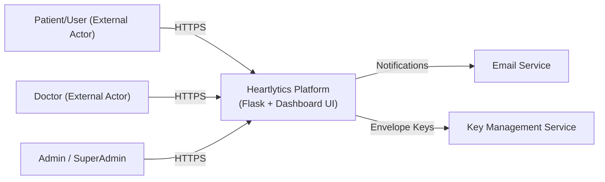

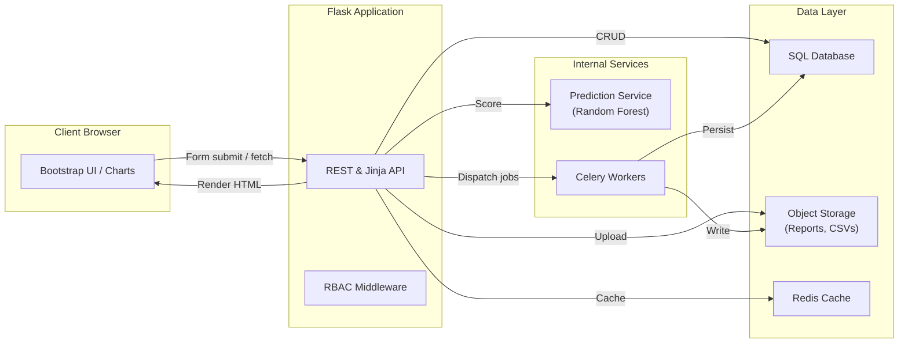

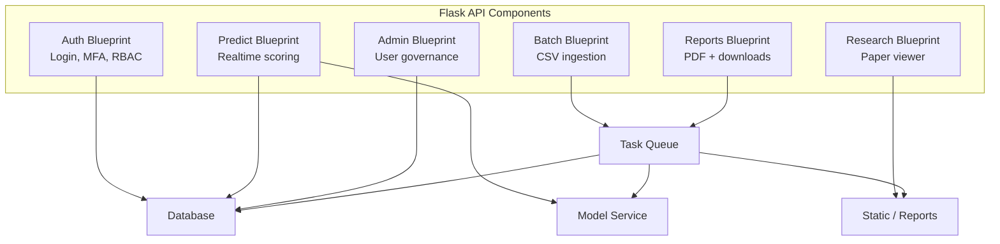

### Operational Flows

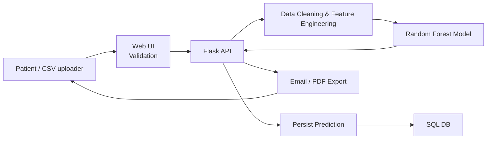

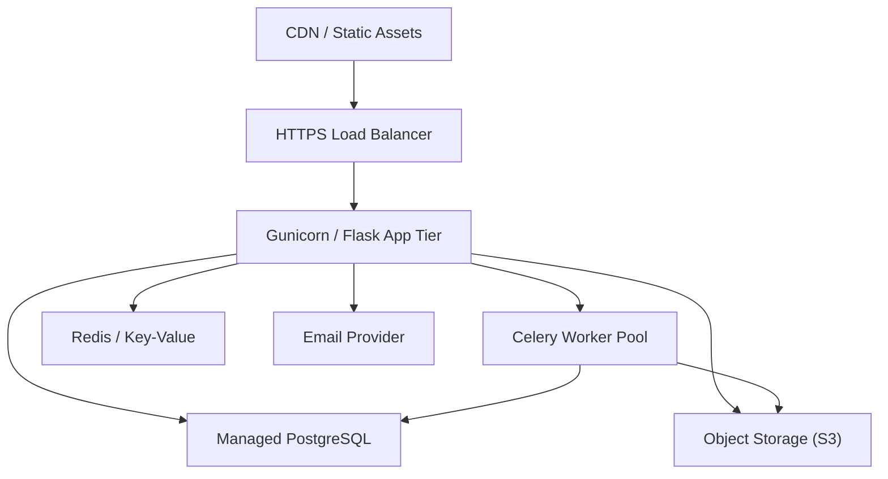

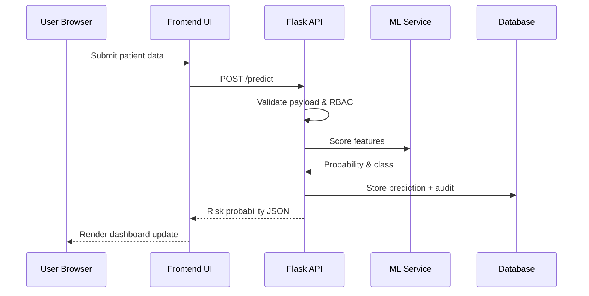

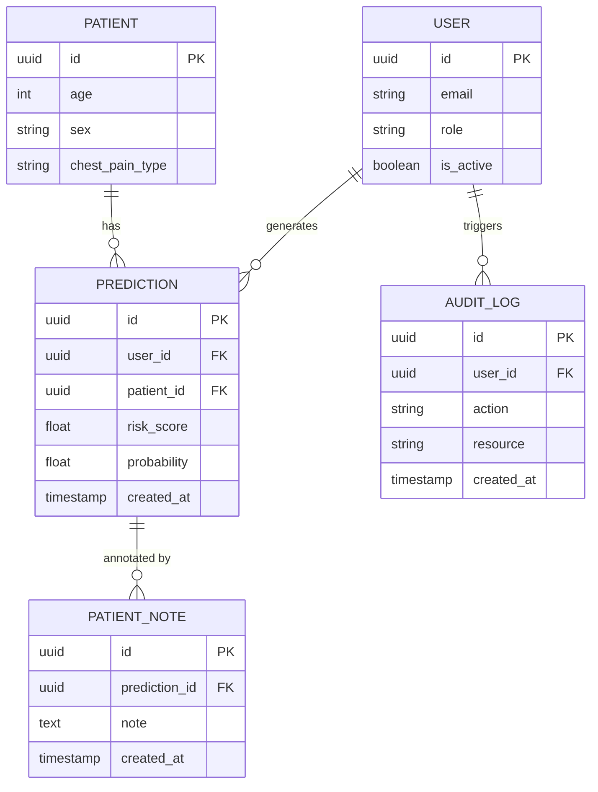

### Identity, Security & Compliance

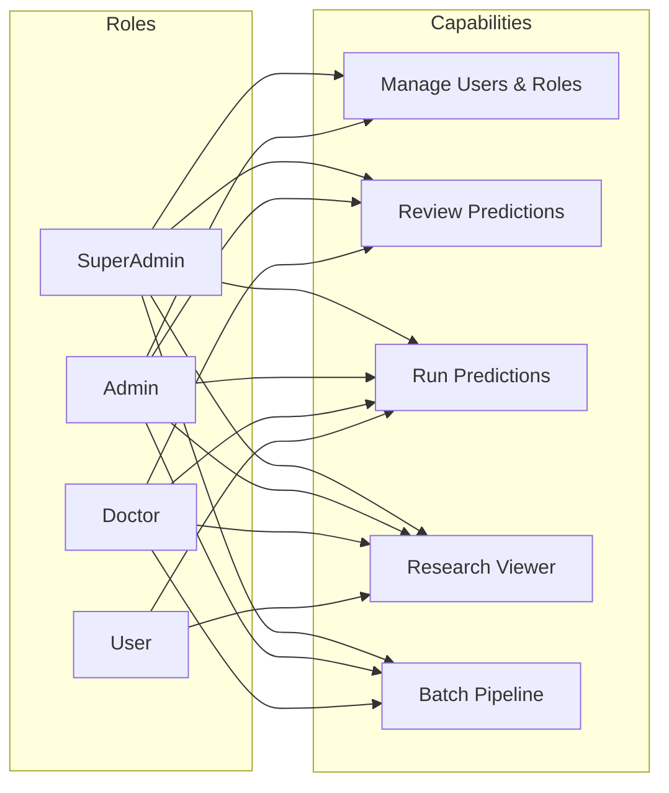

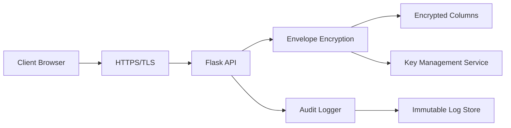

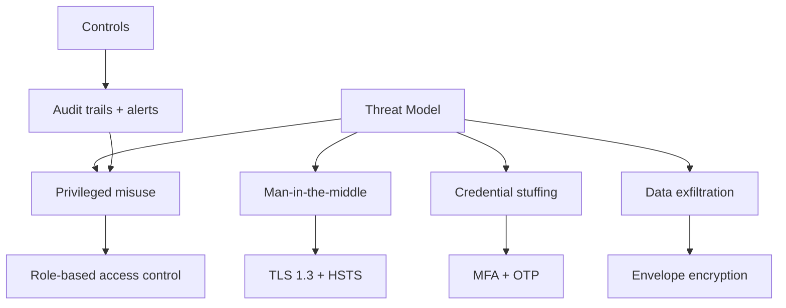

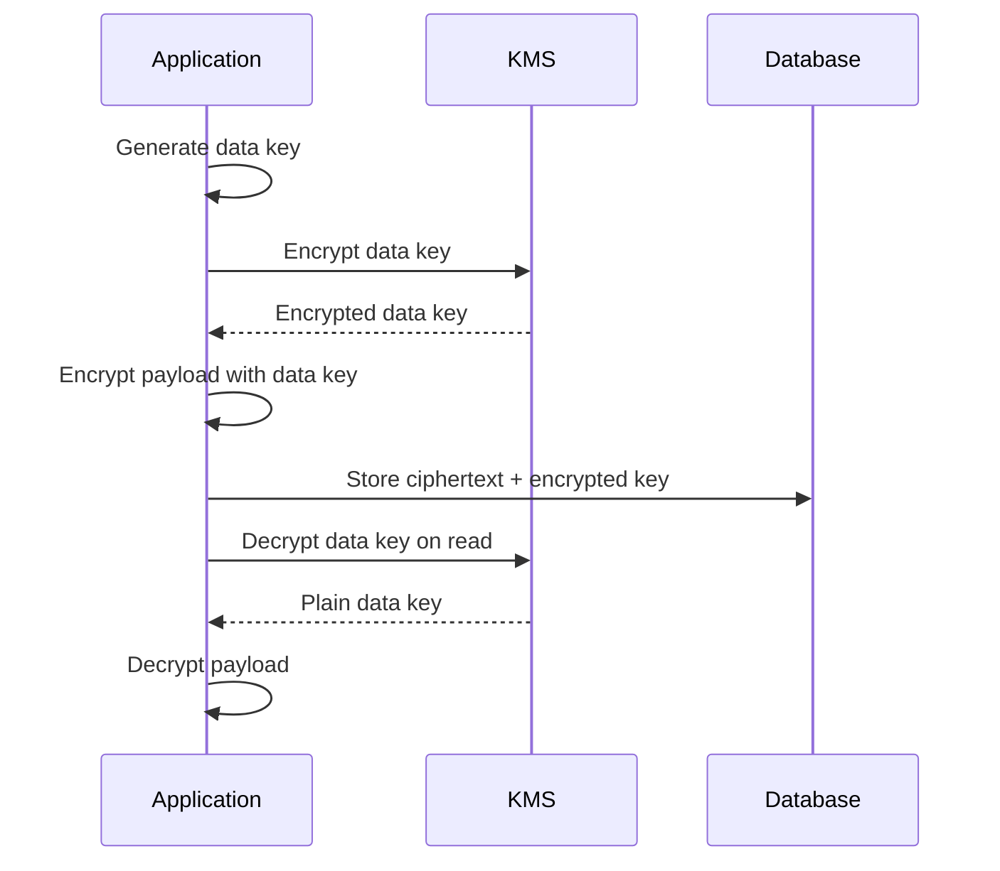

### Multi-Factor & Recovery Journeys

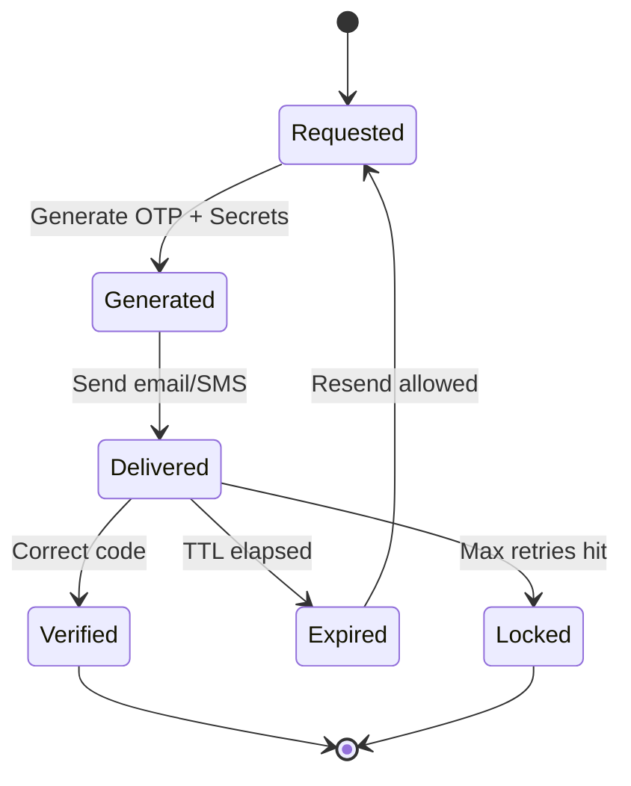

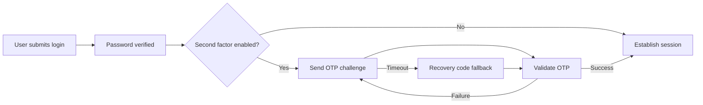

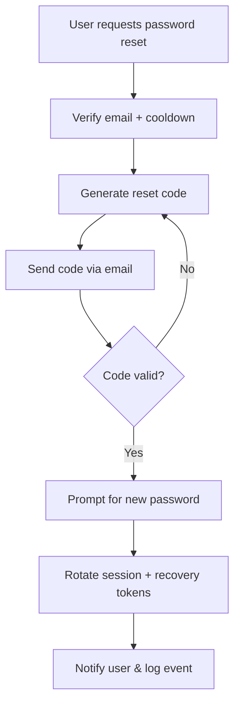

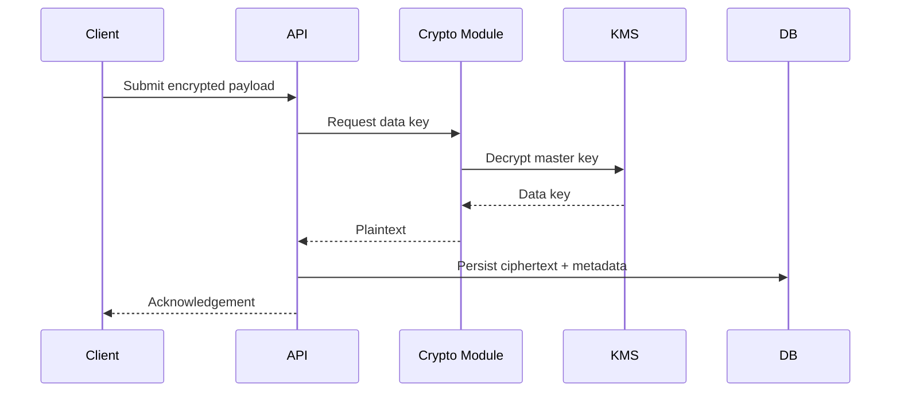

> Complement these with `Diagrams/Sequence%20of%20interactions.png`, `Diagrams/SA.png`, and `Diagrams/fig%203.13%20should%20be%20this%20-%20.png` when you need deeper technical or compliance walkthroughs.

## Role Policy Matrix

| Role       | Predict | Batch | Dashboard | Research | Admin Dashboard |
|------------|:------:|:-----:|:--------:|:--------:|:--------:|
| SuperAdmin |   ✔    |   ✔   |     ✔    |    ✔     |    ✔     |
| Admin      |   ✖    |   ✖   |     ✖    |    ✖     |    ✔     |
| Doctor     |   ✔    |   ✔   |     ✔    |    ✔     |    ✖     |
| User       |   ✔    |   ✖   |     ✖    |    ✖     |    ✖     |

Use the Flask CLI to manage roles:

```bash
flask roles set <email> <ROLE>
```

Roles are one of `SuperAdmin`, `Admin`, `Doctor`, or `User`.

---

## 🛠 Tech Stack
- **Backend**: Python, Flask, Flask-SQLAlchemy
- **ML**: scikit-learn, pandas, numpy
- **Frontend**: Jinja2 templates, Bootstrap 5, Plotly.js
- **Reports**: ReportLab for PDF export
- **Database**: SQLite (default)

---

## 🎨 UI Theming

The application ships with a light theme by default. Users may toggle to a dark
theme using the navbar button or from the **Settings** page. The preference is
stored in `localStorage` and a cookie so server-rendered pages load in the
correct mode with no flash. Plotly and Chart.js visualizations automatically
adapt — in dark mode charts render on transparent backgrounds with updated text
and grid colors. See [`docs/ui-theming.md`](docs/ui-theming.md) for guidance on
extending theming.

## 🎬 Motion Guidelines

Utilities like `.animate-fade` and `.animate-slide` add subtle entrance effects.
Limit movements to 12px and avoid bouncy easings. The token set automatically
honors `prefers-reduced-motion` for accessibility.

---

## 📂 Project Structure
```text
heart-app/
├── app.py               # Application entry point
├── config.py            # Configuration classes
├── helpers.py           # Shared utility functions
├── outlier_detection.py # Outlier detection helpers
├── auth/                # Authentication blueprint and forms
├── doctor/              # Doctor dashboard
├── routes/              # Core Flask blueprints
│   ├── __init__.py
│   ├── predict.py
│   └── settings.py
├── services/            # Business logic and ML helpers
│   ├── auth.py
│   ├── data.py
│   ├── pdf.py
│   ├── security.py
│   └── simulation.py
├── simulations/         # What-if risk modules
├── superadmin/          # Superadmin dashboard and management
├── user/                # Basic user dashboard
├── templates/           # Jinja2 templates
│   ├── base.html
│   ├── error.html
│   └── predict/
│       ├── form.html
│       └── result.html
├── static/              # CSS, images and sample files
│   ├── styles.css
│   ├── logo.svg
│   └── sample.csv
├── ml/                  # Trained model artifacts
│   └── model.pkl
├── tests/               # Pytest suites
│   ├── test_predict.py
│   └── ...
├── research_paper.tex   # Research paper content
└── requirements.txt     # Python dependencies
```

## 🗺️ Blueprints

- `predict` – renders the prediction form and returns the model's risk assessment.
- `settings` – profile management and activity logs.
- `simulations` – interactive what‑if analysis tools.
- `doctor` – dashboard for doctors to view their patients.
- `user` – simple dashboard for regular users.
- `superadmin` – user management, approvals, and audit logs.

---

## 🚀 Quickstart

### 1. Clone the repo
```bash
git clone https://github.com/rasikasrimal/heart-disease-risk-app.git
cd heart-disease-risk-app
```

### 2. Create a virtual environment
```bash
python -m venv .venv
source .venv/bin/activate   # Linux/Mac
.venv\Scripts\activate      # Windows
```

### 3. Install dependencies
```bash
pip install -r requirements.txt
```

### 4. Configure environment variables
Copy `.env.example` to `.env` and adjust the values for your environment:
```bash
cp .env.example .env
```

### 5. Run the app
```bash
flask run
```
App will run at: http://127.0.0.1:5000

### 6. Run tests
```bash
pytest
```

### Environment variables

The application reads configuration from environment variables (see `.env.example`):

| Variable    | Description                                  | Default                     |
|-------------|----------------------------------------------|-----------------------------|
| `SECRET_KEY`| Flask secret key for sessions                | random value                |
| `DATABASE_URI` | Database connection string                | `sqlite:///instance/app.db` |
| `MODEL_PATH`   | Path to the trained model file            | `ml/model.pkl`              |
| `FLASK_ENV`    | `development` loads `DevelopmentConfig`   | `production`                |
| `ENCRYPTION_ENABLED` | Enable envelope encryption on writes | `0` |
| `READ_LEGACY_PLAINTEXT` | Read plaintext columns if ciphertext missing | `1` |
| `KMS_PROVIDER` | `dev` uses local keyring                  | `dev` |
| `DEV_KMS_MASTER_KEY` | base64 master key for dev keyring    | _none_ |
| `DEV_KMS_IDX_KEY` | base64 key for blind indexes           | _none_ |
| `RESET_CODE_TTL` | Minutes before a reset code expires | `10` |
| `RESET_RESEND_COOLDOWN` | Seconds before another code can be sent | `30` |

### Gmail SMTP configuration

Enable 2-Step Verification on the Gmail account and create an **App Password**.
Configure these environment variables so the Forgot Password flow can send
codes over TLS:

```
EMAIL_PROVIDER=gmail
SMTP_HOST=smtp.gmail.com
SMTP_PORT=587
SMTP_USERNAME=<gmail address>
SMTP_PASSWORD=<gmail app password>
MAIL_FROM=<gmail address>
MAIL_REPLY_TO=<support email>
OTP_TTL_MIN=10
OTP_LENGTH=6
OTP_MAX_ATTEMPTS=5
OTP_RESEND_COOLDOWN_SEC=30
MFA_EMAIL_ENABLED=1
MFA_EMAIL_CODE_LENGTH=6
MFA_EMAIL_TTL_MIN=10
MFA_EMAIL_MAX_ATTEMPTS=5
MFA_EMAIL_RESEND_COOLDOWN_SEC=30
```
```
Remove-Item -Force -ErrorAction SilentlyContinue .\instance\app.db, .\instance\app.db-wal, .\instance\app.db-shm
```
Use the `/debug/mail` page (SuperAdmin only) to send a test message and inspect
recent delivery events.

## 📈 Example Workflow

1. **Enter Data** → Open the homepage and fill in patient details through the form.
2. **Batch Predict** → Upload a CSV, map columns, and review cleaned data.
3. **Analyze Trends** → Use the dashboard to explore KPIs and charts.
4. **Export Reports** → Download patient-level PDFs or the full dashboard report.

---

## ⚠️ Disclaimer

This project is provided strictly for **educational and demonstration purposes**.
It is **not a medical device**, and its outputs must **not** be used as a substitute for professional medical advice, diagnosis, or treatment.

