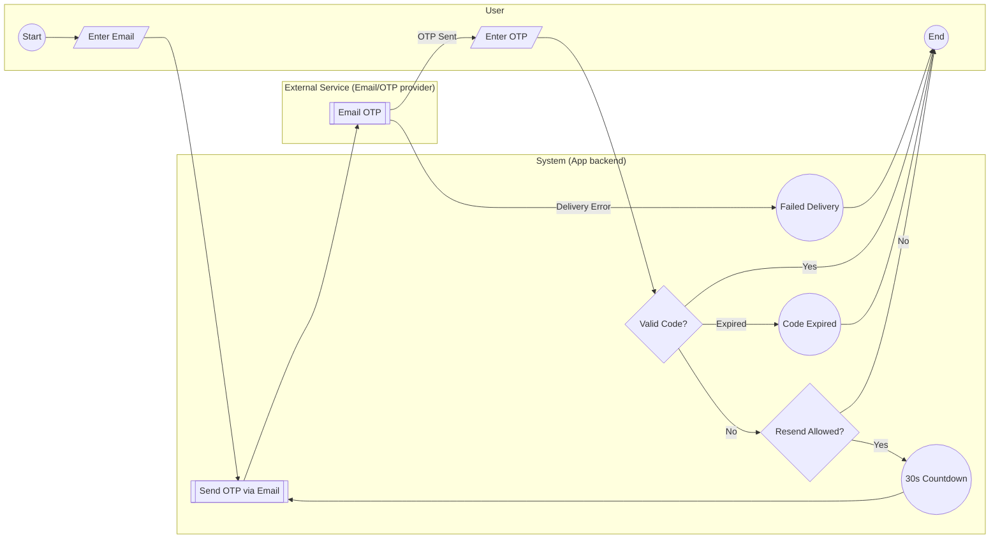
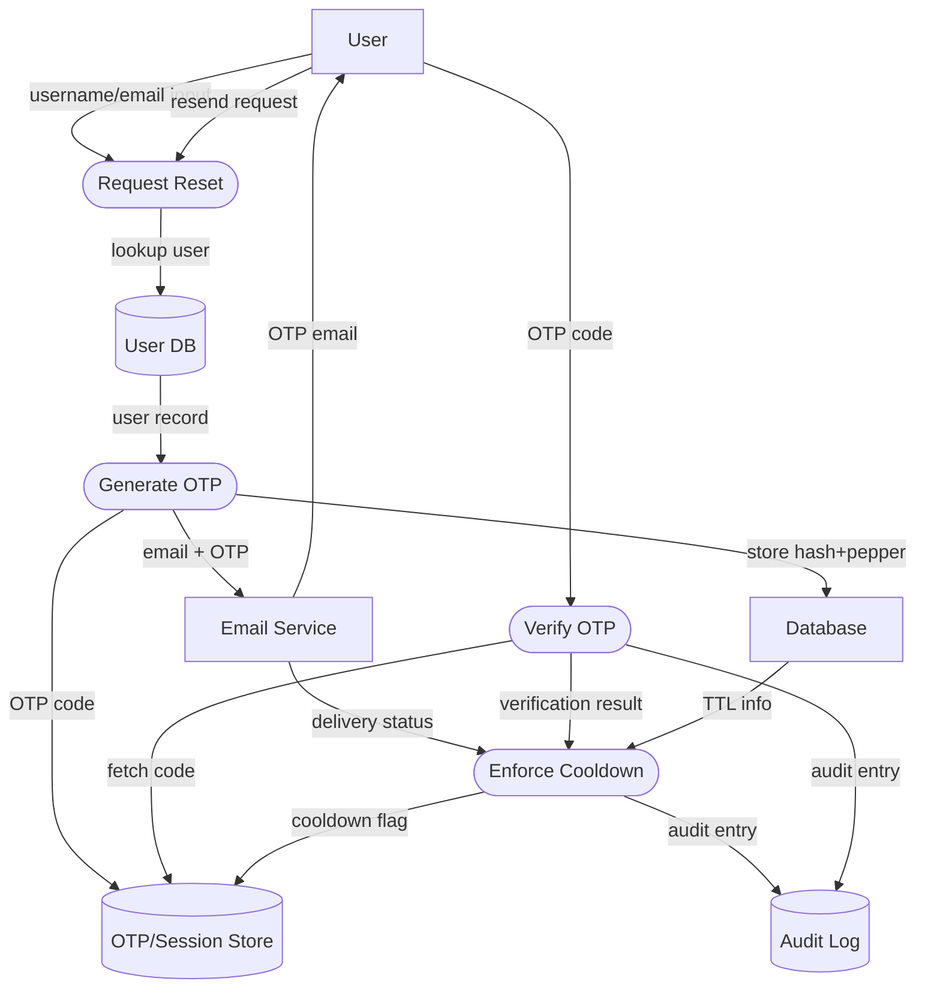

## BPMN Diagram for 2-Step Verification

The BPMN diagram shows how a user requests a one-time code, receives it via email, and submits it for verification. The process separates responsibilities into user, system, and external service lanes. After entering an email, the backend sends the code through an email provider. The user inputs the received code, which the system validates. If the code is invalid and the resend cooldown has expired, a timer event triggers another send.

Security features include hashed OTP storage with pepper, rate limiting on resend attempts, delivery failure and expiration error paths, and a 30-second cooldown timer to prevent abuse. Usability considerations encompass a visible countdown, disabled resend button during cooldown, and accessible forms for entering email and code.

The forgot-password interface uses a compact authentication card with segmented six-box code inputs and Bootstrap 5 components. Each box auto-advances on input and accepts pasted codes across all fields. A muted countdown badge visually indicates when the disabled resend button will become active.

The redesigned sign-up page reuses this segmented OTP component for its email verification step and offers a dedicated "Send OTP" button that dispatches the six-digit code to the specified email, providing a consistent experience.

All authentication screens now honor the GitHub-style dark theme with
slate backgrounds and blue highlights, maintaining consistent contrast and
focus styles across the password reset and signup flows.

## Detailed Data Flow Diagram (DFD)

The DFD details data movement between external entities and internal processes. A user submits an email, which the backend checks against the user database before generating and emailing a hashed OTP. The OTP and cooldown flags reside in dedicated stores, while audit logs capture verification attempts. The external database provides TTL metadata used by the cooldown process.

Security controls include hashing with pepper, TTL enforcement, audit logging, and cooldown flags that rate-limit resend attempts. Usability is addressed by clear prompts, feedback on delivery status, and mechanisms that prevent accidental or repeated requests while keeping the interface accessible.
