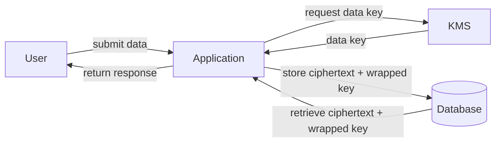
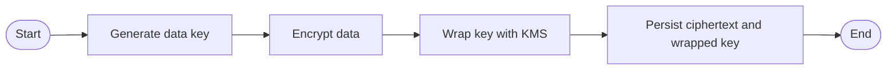

# Envelope Encryption

This application uses application-level envelope encryption for select
sensitive fields.

## High-level diagrams

### Data flow

### BPMN 2.0 process

## Design

* A random 256-bit data key is generated for each encryption operation.
* Data is encrypted using AES-256-GCM. Nonces are 12 random bytes.
* Data keys are wrapped using the configured keyring (dev uses
  `DEV_KMS_MASTER_KEY`).
* Associated data binds table and column: `table:column|kid|kver`.
* The database stores ciphertext, nonce, tag, wrapped key, key id and
  key version in separate columns suffixed with `_ct`, `_nonce`, `_tag`,
  `_wrapped_dk`, `_kid` and `_kver`.
* TOTP secrets for multi-factor authentication follow the same
  envelope-encrypted structure and are never stored in plaintext.

## Adding a new encrypted field

1. Add the component columns as above.
2. Create a property that uses `services.crypto.envelope` to encrypt and
   decrypt values. Use the table and column names in the context.
3. Keep legacy plaintext columns while `READ_LEGACY_PLAINTEXT` is true.

## Rollout flags

* `ENCRYPTION_ENABLED` – enable encryption on writes.
* `READ_LEGACY_PLAINTEXT` – read legacy plaintext values if no
  ciphertext is present.
* `KMS_PROVIDER`, `KMS_KEY_ID` – select the keyring provider.

## Key rotation

1. Provision a new KMS key and update `KMS_KEY_ID`.
2. Run a rewrap procedure to unwrap existing data keys with the old key
   and wrap with the new key id.
3. Increment `kver` as needed and deploy.

## Cryptographic erasure

Disabling or deleting the KMS key prevents future decryption of wrapped
keys, effectively erasing the protected data.

## Non-sensitive preferences

UI theme choice is stored in a long-lived `theme` cookie and
`localStorage`. The cookie is read server-side—even on the authentication
pages—so the selected mode is applied on first render. The value is a
simple string (`"light"` or `"dark"`) and does not require encryption.

Recent simulation enhancements add an inline auto-update loader and
status acknowledgment on the results panel. These UI changes operate
client-side and introduce no new encrypted fields or key management
requirements.

## Password reset codes
Password reset verification codes are never stored in plaintext. The application hashes each six-digit code with a server-side pepper and compares submissions using constant-time checks. Codes expire after a short TTL and are deleted once used.
