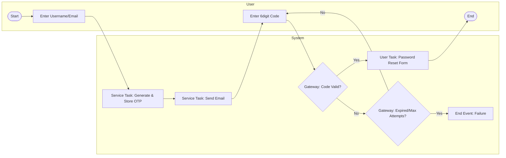
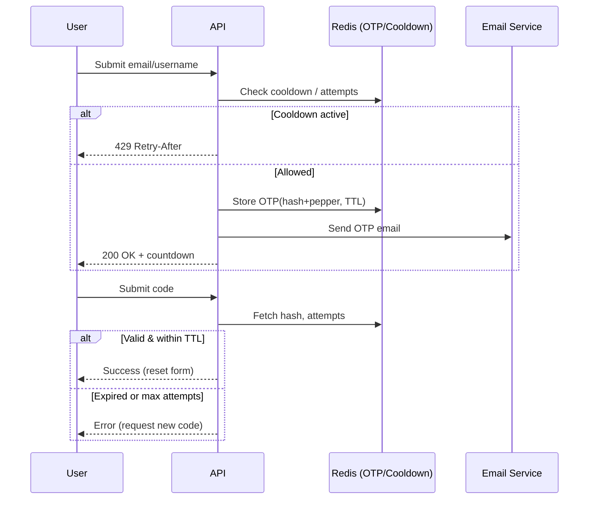
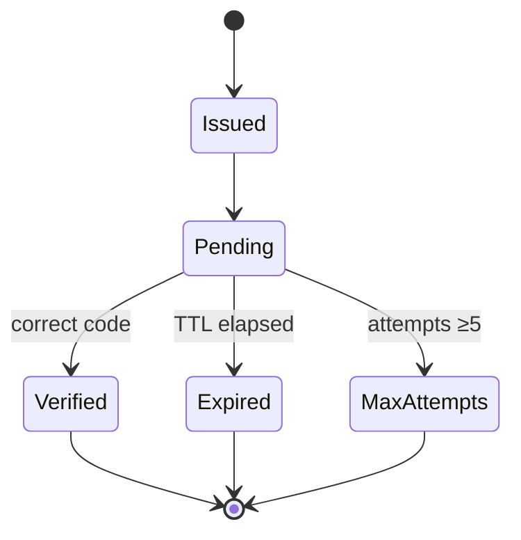

# Forgot Password / 2-Step Verification Flow

This guide describes the password reset process and its security controls. For
encryption details see [Security and Encryption](security_and_encryption.md).

> **Assurance notes:** six‑digit codes are hashed with a pepper, compared in
> constant time, and expire after 10 minutes. Requests are limited to five per
> hour per IP and identifier with a 30‑second resend cooldown.

## Process Overview

- User submits email or username.
- System issues a one‑time code (OTP), stores only the hash and logs the event.
- Email delivers the code; user enters it within the TTL.
- On success the password reset form is displayed; otherwise retry with respect
  to cooldown and attempt limits.

## BPMN 2.0

The diagram shows user and system swimlanes. A timer boundary on the resend
path enforces a 30‑second cooldown, while the exclusive gateway branches to a
failure end event if the code expires or the attempt counter is exhausted.
Source BPMN is available as `img/forgotpassword.bpmn`.

## Sequence: Request, Resend, Verify

## State Machine

The OTP starts in the **Issued** state and becomes **Pending** while awaiting
user input. It transitions to **Verified** on a successful constant‑time
comparison, **Expired** when the 10‑minute TTL elapses, or **MaxAttempts** after
five failures. All transitions are logged to the audit trail.

---

Rate limits and cooldowns enforce trust boundaries between unauthenticated
requests and privileged password changes. RBAC ensures users may only reset
their own accounts after verification.

