# Forgot Password / 2-Step Verification Flow

## 1. Overview
The forgot-password and verification flow allows users to reset credentials securely when access is lost. It delivers a time-bound one-time password (OTP) over email and requires a second factor (TOTP or backup codes) to mitigate account takeover.

### Functional Requirements
- Deliver OTP via email with configurable templates.
- OTP and verification TTL of 5 minutes; resend cooldown of 30 seconds.
- Enforce rate limits per user and IP; maximum 5 attempts per hour.
- Support email delivery and TOTP challenge when enabled.

### Non-Functional Requirements
- Security: hash+pepper OTP, constant-time comparison, HSTS, secure cookies.
- Privacy: PII minimisation, audit logs redacting secrets.
- Reliability: retryable email queue, transactional database updates.
- Accessibility: screen-reader labels, focus management on dialogs.

## 2. BPMN 2.0 Process

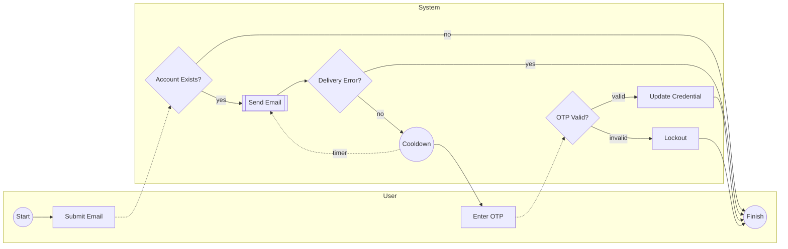

The process begins when the user submits a reset request. The system verifies the account and invokes a call activity to send the email. A boundary error event handles delivery failures, short-circuiting to a user-facing error. Upon success, the user waits through a cooldown timer before receiving the OTP. Verification passes through an exclusive gateway that updates the credential or triggers a lockout. A compensation note indicates that a lockout is rolled back if later verification succeeds.

## 3. Data Flow Diagrams
### Level‑0 Context
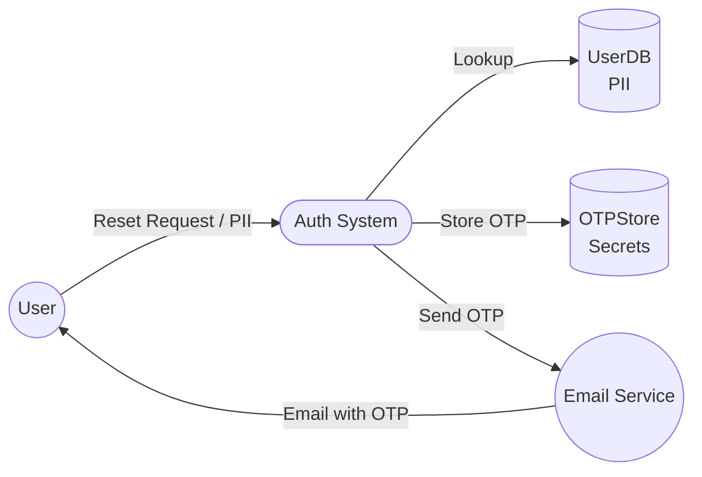
The context diagram shows the user interacting with the Auth System. Data stores are internal, while the Email Service is external and untrusted. PII and secrets never leave the system boundary except for the minimal OTP sent via email.

### Level‑1 Process
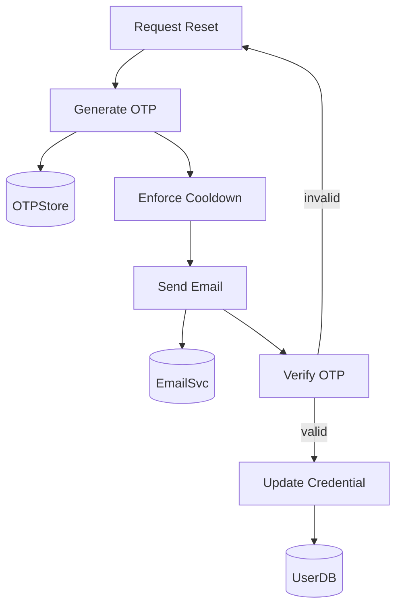
Level‑1 expands the system into discrete processes. Data flows are labelled, and trust boundaries exist around the Email Service. Cooldown enforcement happens before sending to avoid spamming.

### Level‑2 Internal Details
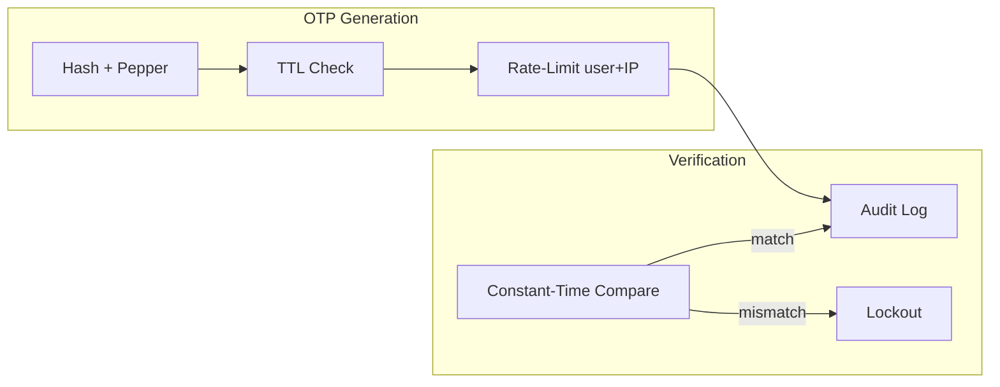
Level‑2 details cryptographic handling, TTL enforcement, rate limiting, and audit logging. Each subprocess runs within the system's trust boundary; only audit logs are exported to immutable storage.

## 4. C4 Model (Architecture)
### C1 Context
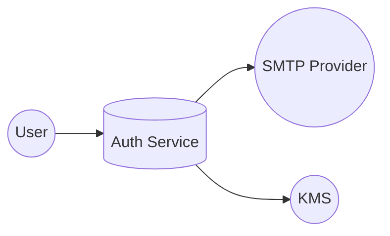
The context view positions the Auth Service between the user, the SMTP provider, and key management.

### C2 Container
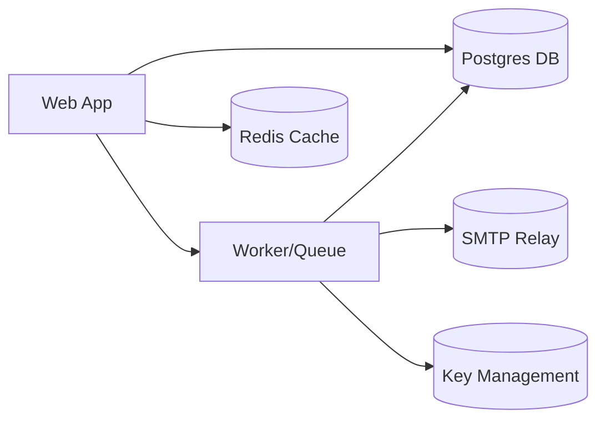
The container view shows the web application accepting requests, delegating email work to a background worker that interacts with SMTP and KMS, while using Postgres and Redis.

### C3 Component
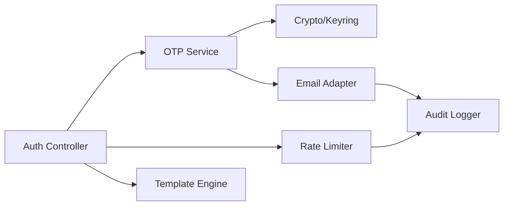
Components show how the Auth Controller orchestrates services. The OTP Service relies on crypto and email adapters; rate limiting and auditing provide cross-cutting concerns.

## 5. Sequence Diagram (End-to-End)
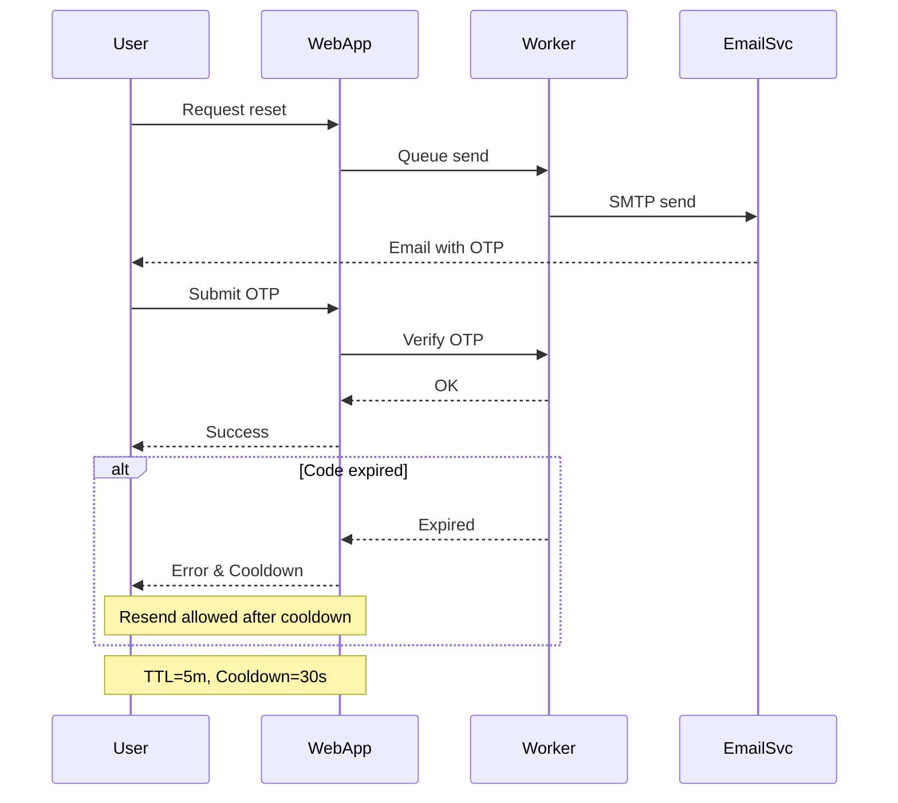

## 6. State Machine (OTP Lifecycle)
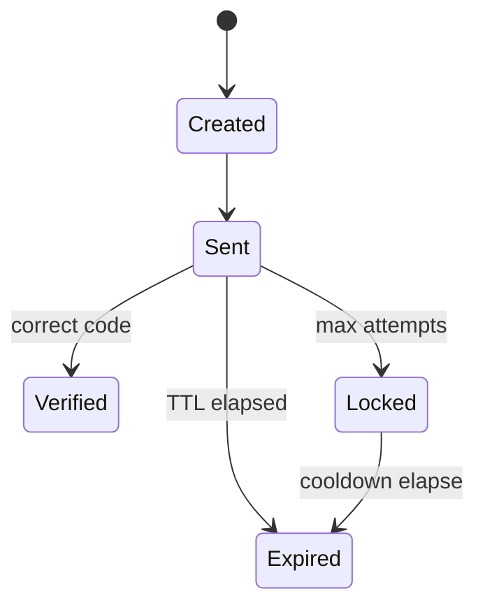

## 7. Timing Diagram (Resend Cooldown)
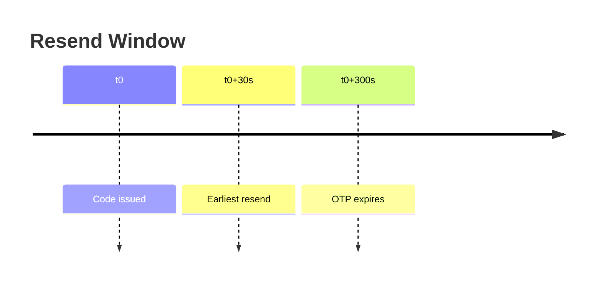

## 8. Threat Model (Security)
### STRIDE
| Threat | Vector | Mitigation |
| --- | --- | --- |
| Spoofing | forged emails | DKIM, SPF, 2FA |
| Tampering | OTP replay | hash+pepper, TLS |
| Repudiation | denial of request | immutable audit logs |
| Info Disclosure | brute-force OTP | rate limits, lockout |
| DoS | mass requests | IP+user throttling |
| EoP | code guessing | strong entropy, cooldown |

### Attack/Abuse Tree
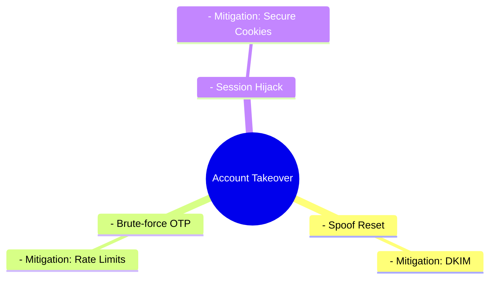

## 9. Data & Schema
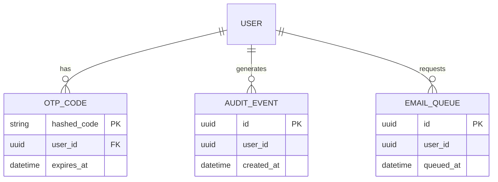
Data retention: OTP codes auto-delete after TTL via scheduled job. Audit events retained 1 year. PII stored encrypted at rest and decrypted only in memory.

## 10. Observability & Metrics
- Audit events: reset_requested, otp_sent, otp_verified, otp_failed, account_locked.
- Metrics: send_success, send_latency, verify_success_rate, lockout_count.

## 11. Test Plan
- Unit: OTP generation/verification, TTL expiry, cooldown enforcement, lockout threshold.
- Integration: simulate email failures, rate-limit counters per IP, audit logging.
- UI: ensure "Resend Code" is disabled until countdown completes.

## 12. Appendix: Rendering Notes
GitHub Markdown lacks native BPMN support. The canonical BPMN diagram is provided as an embedded SVG (`assets/forget_password_bpmn.svg`) with a Mermaid flowchart fallback above for inline rendering.
