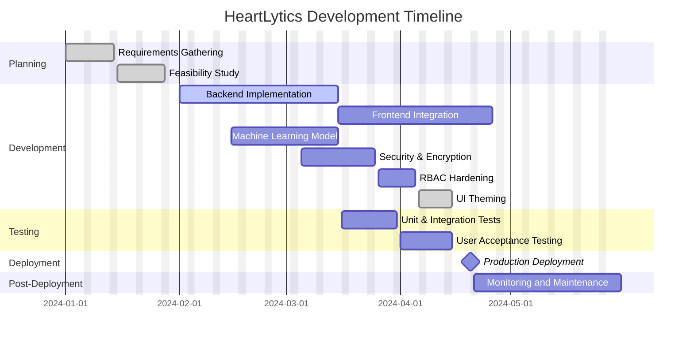

# Project Gantt Chart

The following Gantt chart outlines the major phases, tasks, and milestones for the HeartLytics web application. The chart renders in both GitHub and local Markdown preview.

## Summary
- **Planning** ensures clear requirements and feasibility.
- **Development** covers backend, frontend, model building, and UI theming (light/dark with transparent charts).
- **Testing** verifies functionality and user satisfaction.
- **Deployment** marks the production release.
- **Post-Deployment** includes monitoring and ongoing maintenance.
- Recent iteration adds cleaning-log normalization, a compact batch prediction notice, and a theme toggle on auth pages.
- Latest update introduces server-side masked OTP emails and resend countdowns.
- Latest update introduces an email-based forgot password flow with OTP verification.
- Latest update introduces a spaced, role-aware navigation bar and a shared motion token system.
- Latest update redesigns the sign-up page with a strength meter and mandatory email verification card.
- Latest update redesigns the forgot-password page with a Bootstrap card, segmented OTP inputs, and a visual resend countdown.
- Simulations now feature inline auto-update feedback with subtle loader and timestamped confirmation.
- Forgot-password emails now send via Gmail SMTP with `/debug/mail` diagnostics and rate-limited OTP handling.
- Password resets require re-authentication and send change notifications.
- Optional TOTP-based two-step verification with recovery codes is now available.
- Email-based MFA codes can be enabled as a fallback to TOTP.
- Improved forgot-password flow with hashed codes and resend countdown.
- Migration introduces `email_verified_at` and `email_verification` schema, backfilling legacy users and auto-verifying SuperAdmin-created accounts.

