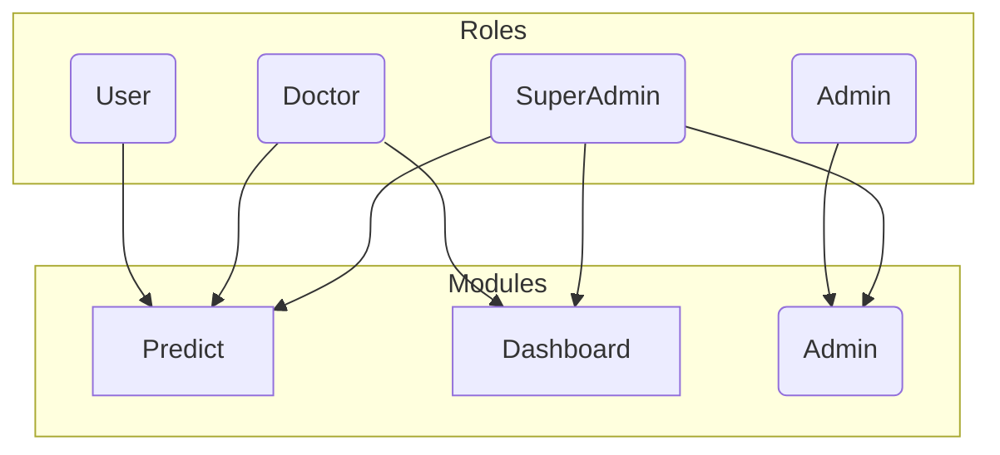
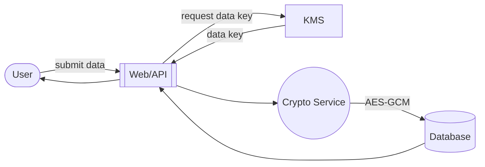
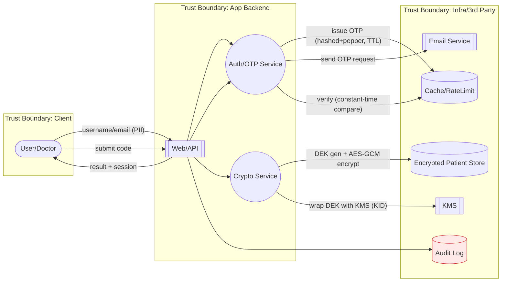
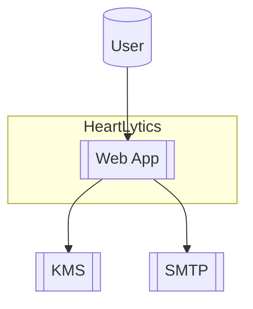
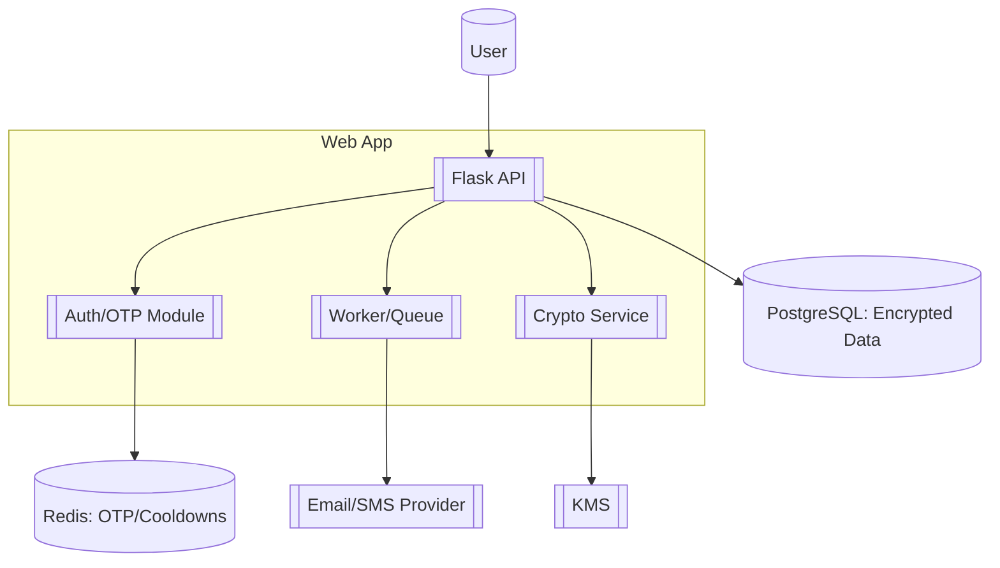
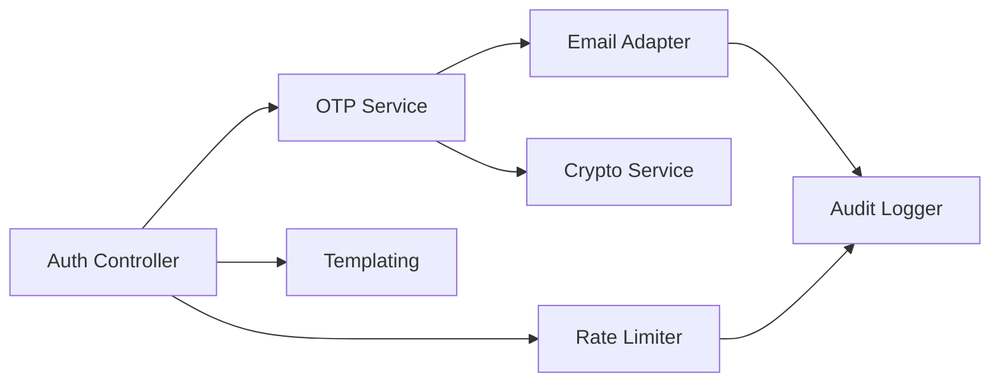
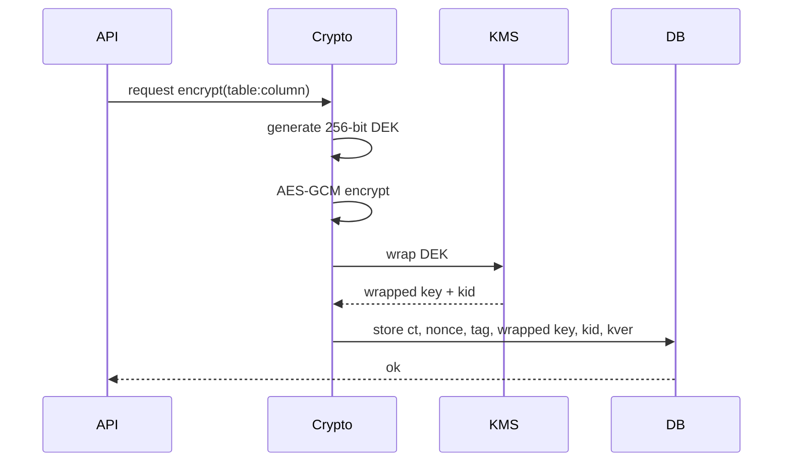
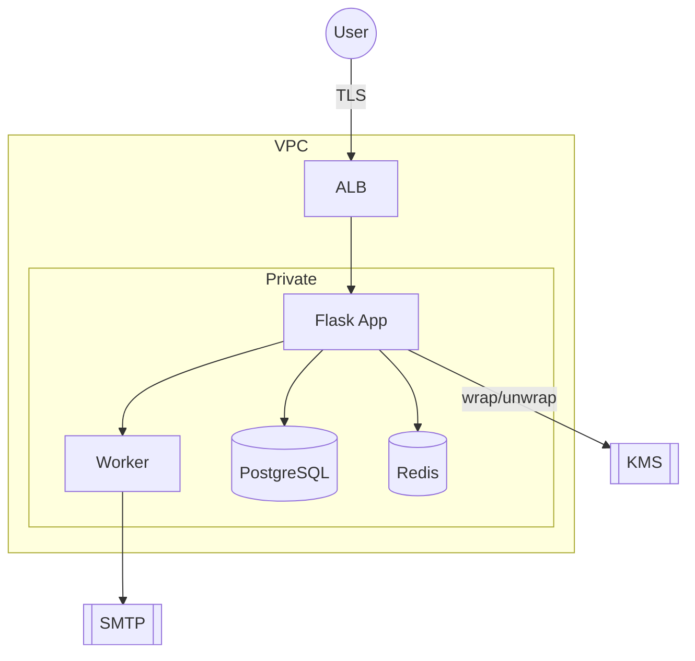
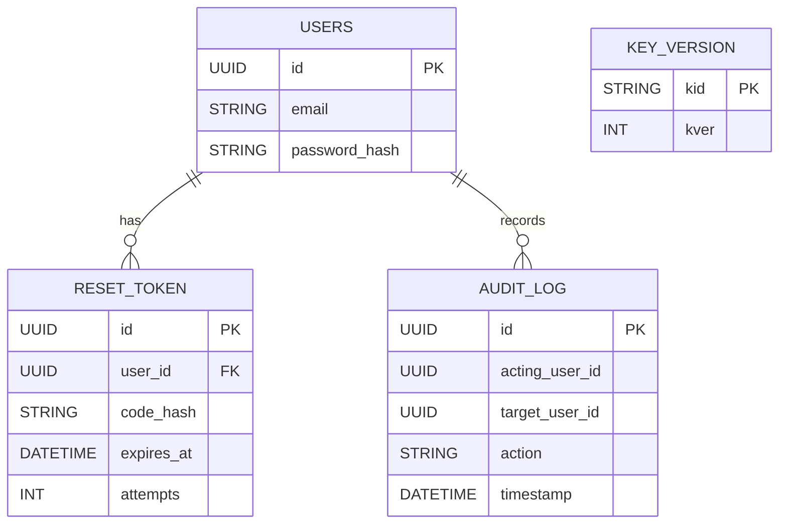
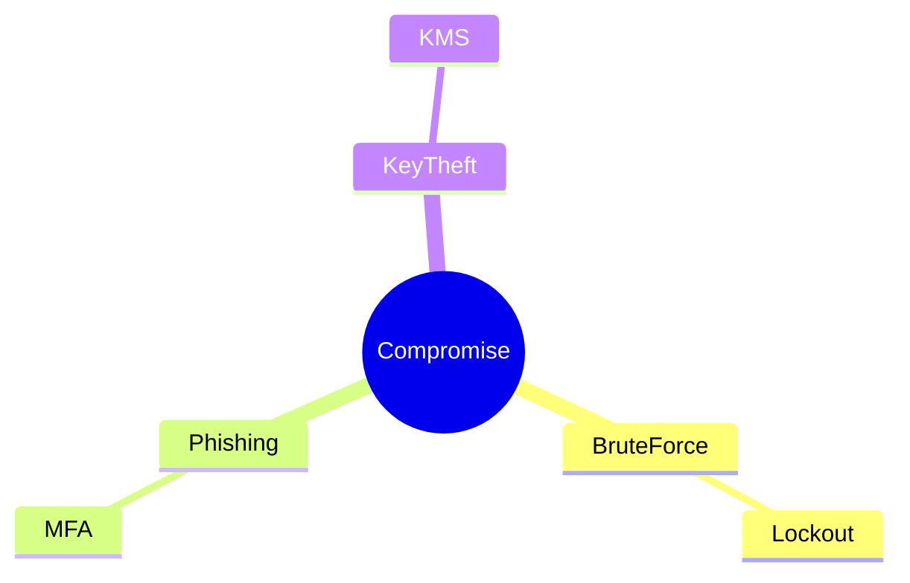

# Security and Encryption

This canonical document consolidates all security guidance for HeartLytics. It
merges the previous `encryption.md` and `security_and_encryption.md` files and
links to the dedicated [Forgot Password / 2‑Step Verification flow](forget_password.md).

> **Assurance notes:** All sensitive operations are logged, protected by rate
> limits, and validated using constant‑time comparisons. Application data is
> encrypted with AEAD and keys are rotated on a regular schedule.

## Authentication

- Session-based authentication with **Flask‑Login**.
- Email and TOTP factors provide optional multi-factor authentication.
- Verification emails display masked addresses and respect resend cooldowns enforced on the server.
- Password resets force a fresh login and send a notification email.
- Login, OTP request, and verification endpoints enforce per‑IP and per‑ID
  limits to deter brute force attempts.
- Redesigned forgot-password page uses segmented OTP inputs and a visible countdown badge without exposing full email addresses.
- Sign-up form features a client-side password strength meter and requires email verification using the same OTP component.
- Email verification codes are stored hashed with expirations in the `email_verification` table; migration backfills `email_verified_at` for existing users and SuperAdmin-created accounts are stamped verified immediately.

## Authorization

Role-based access control (RBAC) restricts modules to specific roles: User,
Doctor, Admin and SuperAdmin. Server-side decorators check roles before any
action is executed, and the top navigation hides links the user cannot access.

## Password Storage

- Passwords use Argon2id via `argon2-cffi`.
- Legacy PBKDF2 hashes are upgraded on successful login.
- OTPs are six digits, hashed with a server-side pepper and compared in
  constant time.

## Envelope Encryption

HeartLytics employs application-layer envelope encryption for patient data and
MFA secrets.

- A random 256‑bit data-encryption key (DEK) is generated per operation.
- Data is encrypted with AES‑256‑GCM; nonces are 12 random bytes.
- The DEK is wrapped by the configured keyring and stored alongside the
  ciphertext, nonce, tag, key id (`kid`) and version (`kver`).
- Associated data binds table and column: `table:column|kid|kver`.
- TOTP secrets use the same envelope structure and never appear in plaintext.

### Key rotation & erasure

1. Provision a new master key and update `KMS_KEY_ID`.
2. Rewrap existing DEKs with the new key, incrementing `kver`.
3. Disabling or deleting the master key renders stored ciphertext
   undecryptable, providing cryptographic erasure.

## Data Flow Diagram

The DFD highlights trust boundaries and data classifications. Only ciphertext
and wrapped keys leave the application trust zone; KMS and SMTP reside in a
separate infrastructure boundary. Failure to unwrap a key or authenticate data
results in a logged error and safe abort.

## C4 Model

### C4‑1 Context

Users interact with the web app, which in turn communicates with external KMS
and email services.

### C4‑2 Containers

### C4‑3 Components

## Sequence: Envelope Encryption

If wrapping fails or KMS is unavailable, the operation aborts and the request
is logged.

## Deployment

TLS terminates at the load balancer. Security groups restrict inbound traffic to
HTTPS and database ports. Secrets and configuration are injected via environment
variables.

## ERD

## Threat Model Quickview

| Threat | Vector | Mitigation |
| --- | --- | --- |
| Spoofing | forged reset emails | DKIM, SPF, MFA |
| Tampering | ciphertext or key wrapping | AEAD, key integrity checks |
| Repudiation | denial of action | immutable audit logs |
| Information Disclosure | stolen DB | envelope encryption, KMS |
| Denial of Service | mass OTP requests | per‑IP/per‑ID rate limits |
| Elevation of Privilege | role abuse | strict RBAC |

---

For password reset specifics see [Forgot Password / 2‑Step Verification](forget_password.md).

