# HeartLytics: Secure Role‑Based Heart Disease Prediction Web Application

**Author:** HMRS Samaranayaka

**Affiliation:** NSBM Green University, Homagama, Sri Lanka

**Date:** 2025-08-01

## Abstract
HeartLytics is a full‑stack Python/Flask platform that predicts heart disease risk while enforcing strict security, encryption and user experience guarantees. The system ingests single records or CSV batches, cleans and analyzes data, executes a trained Random Forest model, and surfaces results through role‑aware dashboards and PDF reports. Application‑level envelope encryption protects patient identifiers, while Bootstrap 5 theming now uses a neutral pure-black/ash palette with teal accents for accessible light and dark modes. Comprehensive multi‑factor authentication, e‑mail backup codes, and recovery flows ensure that only verified users can access protected resources. Extensive tests and a phased project plan demonstrate the feasibility of deploying HeartLytics as a secure clinical decision‑support prototype.

## Table of Contents
- [Working Topic](#working-topic)
- [Study Area and Study Objectives](#study-area-and-study-objectives)
- [Research Gap](#research-gap)
- [Research Problem / Questions](#research-problem--questions)
- [Research Strategy and Research Method](#research-strategy-and-research-method)
- [System Overview and Architecture](#system-overview-and-architecture)
  - [Context Diagram](#context-diagram)
  - [High-Level Architecture](#high-level-architecture)
- [Data Flow Diagrams](#data-flow-diagrams)
  - [Level-0 DFD](#level-0-dfd)
  - [Level-1 DFD – Batch Upload](#level-1-dfd--batch-upload)
  - [Level-1 DFD – Predict](#level-1-dfd--predict)
  - [Level-1 DFD – MFA Enrollment](#level-1-dfd--mfa-enrollment)
  - [Level-1 DFD – Login with MFA Options](#level-1-dfd--login-with-mfa-options)
  - [Level-1 DFD – Patient Record Encryption Path](#level-1-dfd--patient-record-encryption-path)
- [Data Model and Database Design](#data-model-and-database-design)
- [Security Architecture](#security-architecture)
  - [Multi-factor Authentication](#multi-factor-authentication)
  - [Data Encryption and Key Management](#data-encryption-and-key-management)
- [UI/UX and Theming](#uiux-and-theming)
- [Key Execution Flows](#key-execution-flows)
  - [Login with Theme Persistence](#login-with-theme-persistence)
  - [Data Upload to EDA](#data-upload-to-eda)
  - [Prediction Inference](#prediction-inference)
  - [MFA Login with Step-Up Enforcement](#mfa-login-with-step-up-enforcement)
  - [Encrypted Write and Read](#encrypted-write-and-read)
  - [BPMN Process for Prediction Pipeline](#bpmn-process-for-prediction-pipeline)
- [Implementation Details and Configuration](#implementation-details-and-configuration)
- [Testing and Evaluation](#testing-and-evaluation)
- [Timeline and Project Management](#timeline-and-project-management)
- [Ethics, Privacy, and Compliance](#ethics-privacy-and-compliance)
- [Results, Discussion, and Conclusion](#results-discussion-and-conclusion)
- [References](#references)
- [Appendices](#appendices)
  - [RBAC Matrix](#rbac-matrix)
  - [API Endpoints](#api-endpoints)
  - [Extended Test Cases](#extended-test-cases)

## Working Topic
HeartLytics delivers clinician‑friendly heart disease risk prediction through a Flask web application backed by a scikit‑learn Random Forest model. It targets doctors, researchers and end‑users requiring an auditable, secure and themed interface for interactive or batch predictions.

## Study Area and Study Objectives
Cardiovascular diseases remain the leading global cause of death, accounting for approximately 17.9 million fatalities each year. Early detection enables timely intervention, yet traditional diagnostics like ECG and angiography can be invasive or resource intensive. Recent research applies supervised machine learning to improve risk stratification, with ensemble models such as Random Forest and XGBoost demonstrating strong predictive power.

HeartLytics situates itself in this landscape by providing:

* **Secure data entry and prediction** – single patients and CSV batches.
* **Exploratory Data Analysis (EDA)** – cleaning logs, summary statistics, correlation heatmaps and outlier detection using IQR, Isolation Forest, Z‑Score, LOF and DBSCAN algorithms.
* **Role‑aware dashboards** – Doctors review their own patients; SuperAdmins manage users and audit logs.
* **Envelope encryption** for patient data and patient names, storing ciphertext, nonce, tag and wrapped data keys with key identifiers.
* **Accessible theming** – default light mode, persistent theme cookie and chart patches for dark mode transparency.
* **Comprehensive MFA** – TOTP secrets, email one‑time codes and recovery codes managed through hashed and encrypted stores.

Functional objectives include accurate prediction, reliable batch processing, and intuitive dashboards. Non‑functional objectives target security (RBAC, CSRF, encryption, MFA), usability (theme persistence, responsive UI), and maintainability (tested services, modular blueprints).

## Research Gap
Existing ML pipelines often emphasize predictive accuracy but neglect operational concerns such as secure storage, role separation and accessible visualization. Prior work shows strong model performance, yet integration into a secure web platform with envelope encryption and comprehensive RBAC is less explored. HeartLytics addresses this gap by combining industry‑grade security controls with robust data handling and theming, bridging machine learning outputs and clinical workflows.

## Research Problem / Questions
The central problem is how to deploy heart disease prediction in a manner that is secure, role‑aware and user friendly. Key research questions include:

1. How can application‑level envelope encryption protect patient identifiers without impeding usability?
2. What RBAC policies ensure clinicians access necessary modules while restricting administrative features?
3. How does persistent light/dark theming affect visualization clarity across modules?
4. Can batch EDA and outlier detection enhance clinician trust in model outputs?
5. How can the system be evaluated for security and functional correctness?

## Research Strategy and Research Method
The project follows Design Science Research Methodology (DSRM). Artefacts include the Flask application, encryption utilities, MFA modules and theming components. Iterative development cycles gathered requirements, implemented prototypes, and evaluated functionality through automated tests and user feedback. Data originates from the UCI Heart Disease repository; model analysis leverages Random Forest and XGBoost comparisons. Logs and test outcomes form the basis of evaluation.

## System Overview and Architecture
HeartLytics uses a Python 3/Flask runtime with Jinja2 templates, SQLAlchemy ORM and a scikit‑learn Random Forest model (`ml/model.pkl`). SQLite is the default database, configurable via environment variables. Envelope encryption employs AES‑256‑GCM with per‑record data keys wrapped by a keyring service and blind indexes to enable equality lookup without revealing plaintext.

### Context Diagram
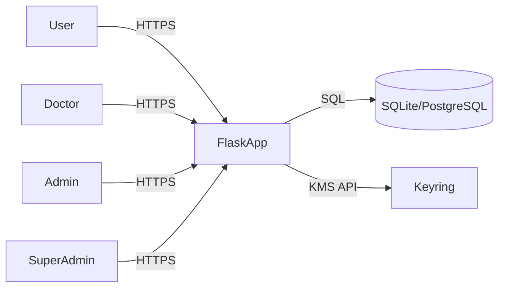

### High-Level Architecture
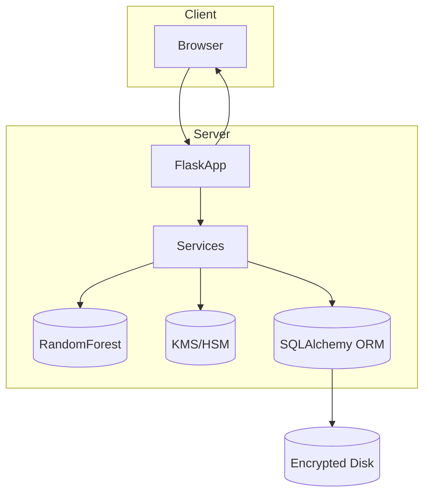

RBAC governs access: SuperAdmin has full rights, Admin lacks Predict/Batch/Dashboard/Research, Doctors see all modules, Users access Predict only.

## Data Flow Diagrams
### Level-0 DFD
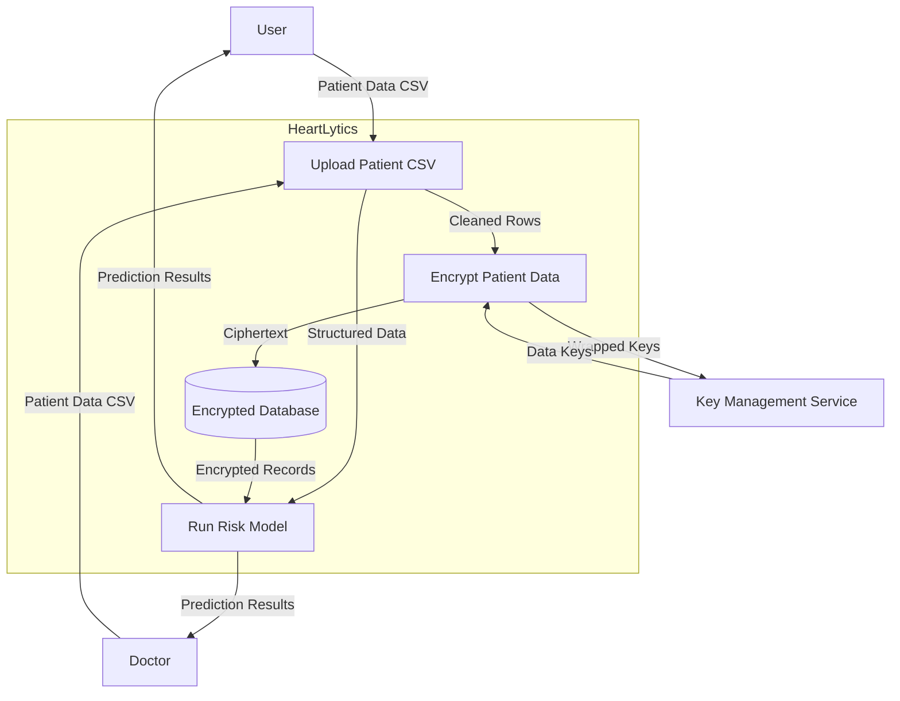

The Level-0 data flow diagram presents HeartLytics as a system boundary containing core processes and storage. External actors such as users, doctors, and the key management service interact with these internal components through labeled flows of patient data, ciphertext, wrapped keys, and results.

This context diagram is relevant because it highlights how raw patient information enters the platform, is encrypted and persisted, and ultimately returns as risk predictions. By labeling each flow, the diagram clarifies the responsibilities of each actor and emphasizes the central role of the encrypted database in safeguarding sensitive records.

### Level-1 DFD – Batch Upload
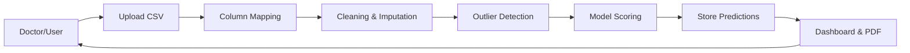

### Level-1 DFD – Predict
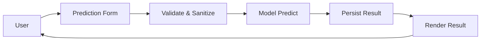

### Level-1 DFD – MFA Enrollment
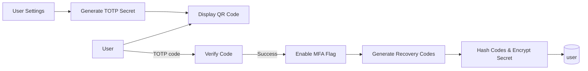
The MFA enrollment flow begins when an authenticated user navigates to the **Settings** page. The server generates a random TOTP secret and passes it to the browser as a base32 string rendered in a QR code. The user scans the QR with an authenticator app, which seeds the app’s OATH-TOTP algorithm. The user then submits a six‑digit code back to the **Verify** process. Verification strips non‑numeric characters and calls `verify_totp`, accepting codes that fall within a ±30‑second window to accommodate device clock skew. Upon success the **Enable** step flips the `mfa_enabled` flag and persists the secret. Before storage the secret is envelope‑encrypted with AES‑256‑GCM; the resulting ciphertext, nonce, tag, wrapped data key, key identifier and key version populate the `mfa_secret_*` columns in the `user` table. Ten random recovery codes are generated, SHA‑256 hashed with a server-side pepper, and stored in `mfa_recovery_hashes`. The hashed recovery codes and encrypted secret are written to the **UserTable** along with the enablement flag. The application returns a dedicated page displaying the one-time recovery codes, instructing the user to store them securely offline. This Level‑1 view omits lower-level crypto operations yet underscores trust boundaries: secrets never leave the server unencrypted, codes are hashed before persistence, and all user actions traverse CSRF‑protected forms. Potential failure paths include invalid code submission, database errors, or duplicate enablement attempts; each is mitigated through form validation, transactional commits and idempotent checks. Rate-limiting guards in the parent login flow ensure that an attacker cannot brute force enrollment codes or flood email channels. Together these processes transform a basic password login into a phishing-resistant MFA setup while preserving usability via QR provisioning and printable recovery codes.

### Level-1 DFD – Login with MFA Options
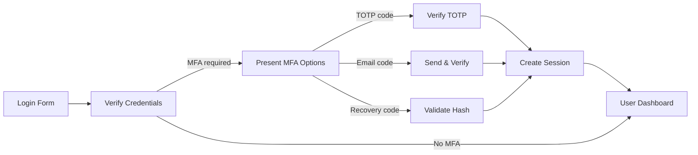
The login Level‑1 DFD captures both password verification and subsequent MFA challenges. Users submit identifiers and passwords to **Cred**, which consults the `user` table. Successful authentication checks `mfa_enabled` and `mfa_email_enabled` flags to determine whether additional factors are required. If no MFA is needed, the process continues directly to **Dash**. When MFA is required, control passes to **Challenge**, which renders options based on user enrollment. Selecting the TOTP path posts a code to **TOTP**, where the server retrieves the encrypted secret, decrypts it with the envelope scheme, and verifies the code using `verify_totp`. Choosing the email path triggers **Email**, which looks up a pending `mfa_email_challenge` row or creates one with a hashed code, expiry and resend counters. The challenge is sent through the email service, and the user returns the code for verification. The recovery path hashes the submitted token and compares it against remaining hashes in `mfa_recovery_hashes`, pruning matches after one use. All three verification sub-processes funnel into **Sess** upon success, where the application records `mfa_last_enforced_at` and issues a session cookie. Failure paths increment attempt counters, enforce per-IP and per-identifier rate limits, and return the user to **Challenge** with an error message. The diagram highlights how single sign-on events can branch into multiple second-factor mechanisms, each with distinct data stores (user table, `mfa_email_challenge`, session). It also shows how fallback paths such as recovery codes and email codes maintain access when authenticator devices are unavailable, while the main TOTP path offers stronger assurance. Ultimately the session creation unifies the flows, allowing normal navigation to the dashboard.

### Level-1 DFD – Patient Record Encryption Path
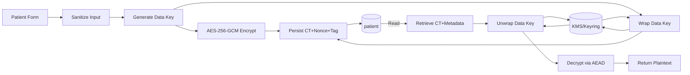
When a clinician submits a patient form, the **Submit** process first passes through **Validate**, which enforces schema and range checks to prevent malformed data. The sanitized payload is serialized to JSON and handed to **GenDK**, which derives a fresh 256‑bit data key for that record. **Encrypt** applies AES‑256‑GCM to the payload, yielding ciphertext, a 96‑bit nonce, and a 128‑bit authentication tag. The table name, column and key metadata (`table:column|kid|kver`) flow in as associated data so the ciphertext is cryptographically bound to its storage context, blocking copy‑paste attacks across fields. In parallel, **Wrap** sends the plaintext data key to the external **KMS/Keyring**; in development the `DevKeyring` performs an AES wrap with a locally provisioned key, whereas production deployments invoke cloud KMS APIs over mutually authenticated channels. The KMS returns a wrapped data key and key identifier, which **Wrap** passes back. **Store** persists the ciphertext, nonce, tag, wrapped key, key id and key version to the `patient` table columns suffixed `_ct`, `_nonce`, `_tag`, `_wrapped_dk`, `_kid` and `_kver` respectively. During reads, the application retrieves the encrypted columns (**Fetch**) and forwards the wrapped key to **Unwrap**, which again calls the KMS to recover the plaintext data key. **Decrypt** feeds the key, nonce and tag into AES‑GCM to reconstruct the original patient payload, and **App** returns it to upstream services. This Level‑1 view underscores several controls: unique data keys and nonces per record thwart AES‑GCM reuse; associated data ties ciphertext to its origin; envelope wrapping facilitates cryptographic erasure if a master key is revoked; and any failure to unwrap or authenticate results in safe null values. Role‑based checks and audit logging can intercede before encryption to ensure only authorized clinicians store data and after decryption to record access. The diagram demonstrates the separation of duties—application code manages validation and AEAD primitives, while the external KMS maintains master keys, enforces key usage via RBAC, and supports rotation workflows.
Key rotation introduces a maintenance branch not shown in the patient request path. Operations staff provision a new master key, update the `KMS_KEY_ID` configuration and run a rewrap job that walks through **Fetch**, **Unwrap** and **Wrap** for every encrypted row, incrementing `kver` on success. Each batch logs progress to `audit_log`, capturing acting user, affected tables and row counts so anomalies can trigger rollbacks. Because data keys are unique per record, partially completed rotations do not jeopardize remaining rows; unrotated entries continue decrypting with the previous key until rewrapped. If the database were exfiltrated without KMS credentials, attackers would find only ciphertext and wrapped keys they cannot unwrap. Conversely, disabling or deleting the master key performs cryptographic erasure, fulfilling right‑to‑be‑forgotten requests without touching individual rows. KMS itself enforces strict IAM policies so only the application role can call `Encrypt` and `Decrypt`, while administrators use separate, audited roles for rotation operations. Together these controls ensure envelope encryption integrates smoothly with operational procedures and keeps the data path clear and auditable from user submission through KMS interaction back to the user interface.


## Data Model and Database Design
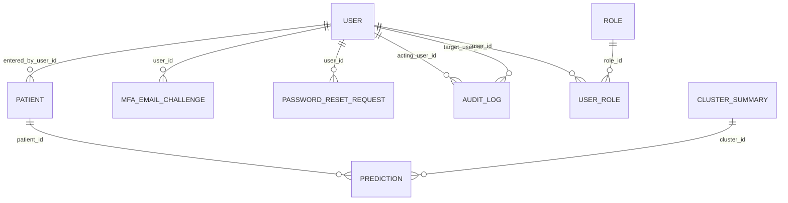

The `user` table stores authentication and MFA state: `mfa_enabled`, `mfa_email_enabled`, `mfa_email_verified_at`, envelope‑encrypted TOTP secrets (`mfa_secret_ct`, `_nonce`, `_tag`, `_wrapped_dk`, `_kid`, `_kver`), hashed recovery codes (`mfa_recovery_hashes`) and a `mfa_last_enforced_at` timestamp to drive step‑up policies. The `mfa_email_challenge` table tracks single-use email codes with hashed values, expiry timestamps, attempt counters, resend counts, requester IPs and user agents. `password_reset_request` mirrors this structure for password recovery. The `patient` table holds envelope-encrypted `patient_data` and `patient_name` fields using the same metadata columns. Storing `kid` and `kver` enables rewrap migrations when rotating master keys. Blind indexes computed via HMAC-SHA256 permit equality searches without leaking plaintext values. Relationships among tables enforce referential integrity while keeping MFA artefacts and encryption metadata tightly bound to their parent records.
All verification templates display masked email addresses so raw identifiers never appear client-side.

## Security Architecture
HeartLytics layers defense-in-depth controls:

* **Authentication** – Session-based logins use Flask-Login with rate limits of five attempts per 15 minutes and permanent sessions subject to server-side timeouts.
* **Authorization** – Role decorators enforce module access, with `RBAC_STRICT` ensuring policies are always active.
* **Password Storage** – Argon2id hashing with automatic rehashing of legacy PBKDF2 credentials provides strong resistance to offline attacks.
* **CSRF Protection** – All modifying requests carry session-bound CSRF tokens.
* **Security Headers** – `X-Content-Type-Options`, `X-Frame-Options`, `Referrer-Policy` and `Permissions-Policy` reduce attack surface.
* **Audit Logging** – Administrative actions are recorded in `audit_log` with acting and target users.

### Multi-factor Authentication
Multi-factor authentication combines three mechanisms:

1. **TOTP (Authenticator Apps)** – Users enroll by scanning a QR code produced from a random base32 secret. Secrets are envelope-encrypted with AES-256-GCM and wrapped data keys, never stored in plaintext. Verification accepts spaces or hyphens to improve usability, normalizes input, and tolerates ±30 seconds of drift.
2. **Email One-Time Codes** – Users with `mfa_email_enabled` can request a fallback code. Each request either reuses an existing pending `mfa_email_challenge` row or creates a new one with a SHA-256 hash, 10‑minute TTL, attempt counter and resend throttle enforced by `MFA_EMAIL_RESEND_COOLDOWN_SEC`. Codes are sent via the configured SMTP provider and verified by hashing input and comparing to the stored hash. Status fields prevent reuse, while daily caps (`MFA_EMAIL_DAILY_CAP_PER_USER`) thwart enumeration.
3. **Recovery Codes** – Ten random 16‑hex‑character tokens are generated at enrollment, hashed and stored. Each code is single-use: upon successful login the matching hash is pruned, and users can regenerate a fresh set in settings.

A **step-up policy** tracks `mfa_last_enforced_at`. High-risk operations compare the timestamp against trust windows (`MFA_TRUST_WINDOW_DAYS_TOTP`, `MFA_TRUST_WINDOW_DAYS_EMAIL`) and require re-authentication if the window has lapsed. If `MFA_STEPUP_REQUIRE_TOTP` is true, only TOTP satisfies step-up; email codes are allowed solely for initial login or when a TOTP device is lost. Rate limits (`RATE_LIMIT_PER_IP`, `RATE_LIMIT_PER_ID`) and attempt counters on `mfa_email_challenge` defend against brute force and enumeration. All MFA routes sanitize codes with regexes, employ CSRF tokens, and log critical events.

### Data Encryption and Key Management
Envelope encryption protects sensitive columns. Each write operation generates a unique 256-bit data key and 96-bit nonce, encrypts data with AES-256-GCM, and wraps the data key with the active KMS provider. Development uses an environment-provisioned `DevKeyring`; production may plug into AWS KMS, Google Cloud KMS, or Azure Key Vault via the `KMS_PROVIDER` and `KMS_KEY_ID` settings. Associated data binds the ciphertext to its table, column, key identifier and version (`table:column|kid|kver`), preventing cross-field substitution. Key rotation follows a runbook: provision a new KMS key, update `KMS_KEY_ID`, rewrap existing data keys, bump `kver`, and deploy. Blind indexes derived from a separate HMAC key (`IDX_KEY_ID`) allow case-insensitive searches without exposing plaintext. Cryptographic erasure is achieved by disabling or deleting the master key—wrapped data keys become undecipherable, rendering ciphertext useless. Role-based enforcement restricts key operations to the application service account; only database columns flagged as encrypted invoke the keyring. Flags `ENCRYPTION_ENABLED` and `READ_LEGACY_PLAINTEXT` control rollout and backward compatibility, allowing gradual migration from plaintext columns to encrypted ones.

## UI/UX and Theming
The default theme is light; a `theme` cookie and `localStorage` entry persist user preference. Server-side hooks expose the theme before rendering to avoid flashes of incorrect color. Client scripts toggle modes and update the cookie, meta theme color and chart libraries; dark mode uses transparent chart backgrounds for seamless integration. A navigation bar surfaces only permitted modules per role and shares motion tokens with buttons, dropdowns and tables, all honoring `prefers-reduced-motion`. Inline loading indicators on the simulations page debounce input changes, cancel stale requests and announce when fresh results are available. The forgot-password flow adopts the same card layout with segmented six-box OTP inputs and a visual resend countdown, maintaining accessibility across screen sizes. The signup page now mirrors this card layout, adding a password strength meter and follow-up email verification.

## Key Execution Flows
### Login with Theme Persistence
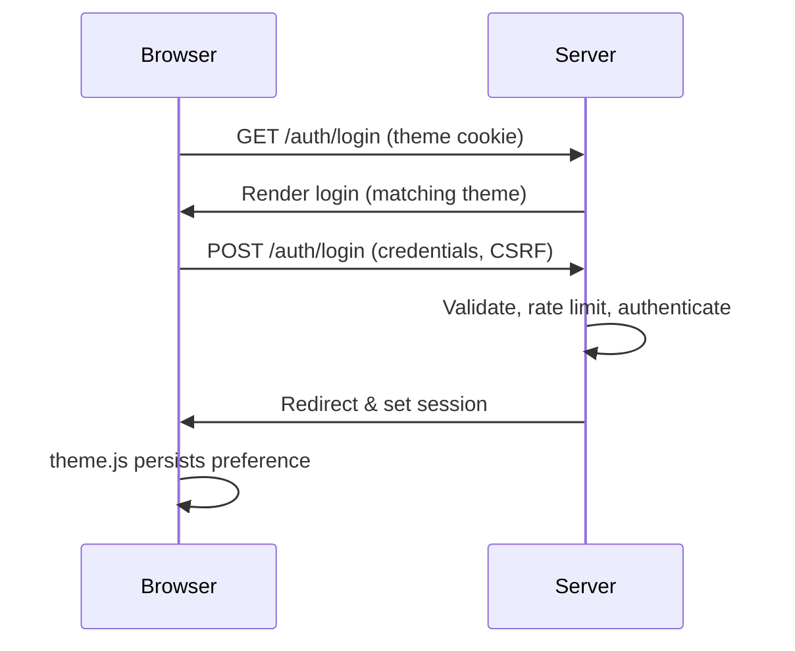

### Data Upload to EDA
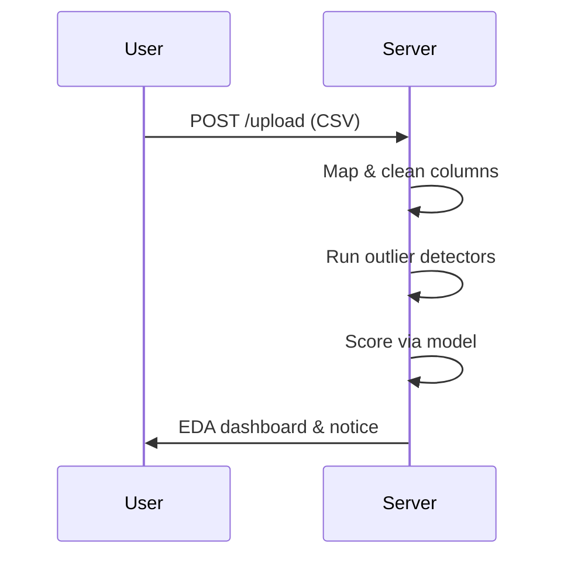

### Prediction Inference
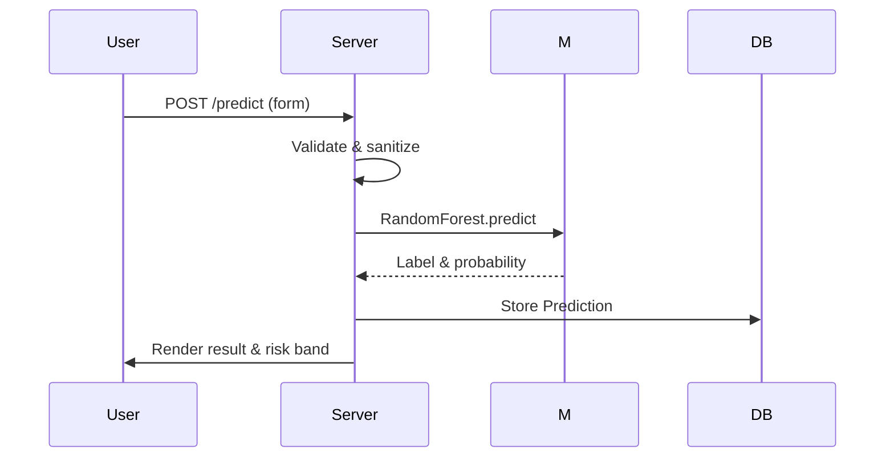

### MFA Login with Step-Up Enforcement
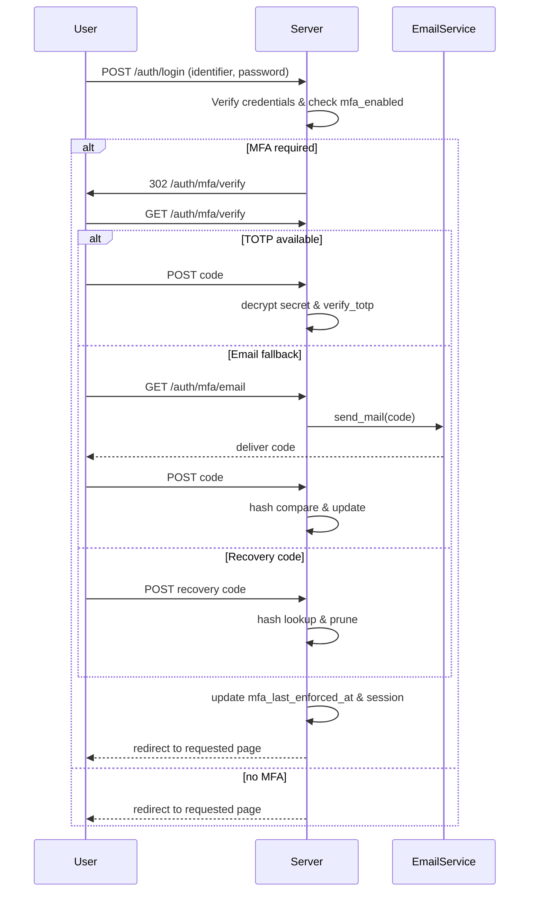
The sequence begins with the user submitting credentials. The server verifies them and consults `mfa_enabled` and `mfa_email_enabled` flags. If MFA is required, the user is redirected to the verification endpoint. The TOTP branch decrypts the secret, ensures the code is timely, and upon success records `mfa_last_enforced_at` and issues the session. The email branch generates or updates an `mfa_email_challenge` row, sends the code via SMTP, and verifies by hashing the user’s input. The recovery branch hashes the submitted code and compares it against the stored list, removing matches to enforce single use. Step-up enforcement compares the new timestamp against trust windows; if the login was triggered by a sensitive action and `MFA_STEPUP_REQUIRE_TOTP` is enabled, only the TOTP branch can satisfy the challenge, forcing a stronger factor. All branches end with session creation and optional “remember device” cookies that suppress prompts until the trust window expires. Failure in any branch increments counters and may lock the challenge record or rate-limit the IP. This flow illustrates how the system gracefully degrades from the preferred TOTP factor to email and recovery codes while maintaining audit trails and enforcing modern MFA expectations.

### Encrypted Write and Read
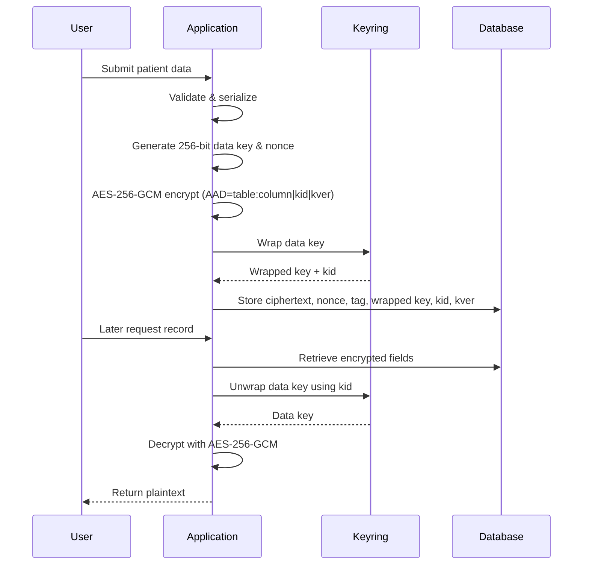
This sequence expands on the previous DFD by detailing temporal ordering and actor responsibilities. The application first serializes validated patient data and generates a random data key and nonce. AES‑256‑GCM encrypts the payload using associated data that ties the ciphertext to the table and column, thwarting relocation attacks. The plaintext data key is sent to the keyring—either a development key loaded from `DEV_KMS_MASTER_KEY` or an external KMS provider—where it is wrapped and tagged with a key identifier. The application persists the ciphertext, nonce, tag, wrapped key, key identifier and version in dedicated columns, enabling later decryption and rotation. On read, the process reverses: fields are fetched, the keyring unwraps the data key, and AES‑GCM decrypts the ciphertext, verifying the authentication tag before returning plaintext. Any discrepancy in tag or unwrapping triggers an exception, causing the property accessor to return `None`. The diagram demonstrates envelope encryption’s separation of concerns: the keyring never sees plaintext data, and the database never stores unwrapped keys. It also shows how key rotation can be achieved by rewrapping stored data keys with a new master key and updating the key version without touching ciphertext. This approach supports cryptographic erasure, complies with defense-in-depth requirements, and integrates seamlessly with the ORM property accessors that hide complexity from higher-level application code.

### BPMN Process for Prediction Pipeline
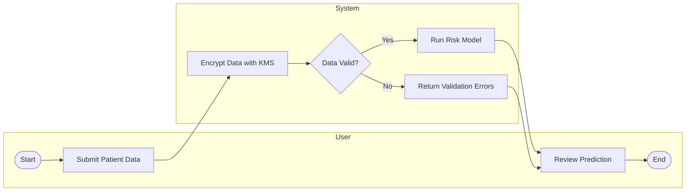

This BPMN 2.0 diagram illustrates the end-to-end prediction workflow with separate swimlanes for the user and system. After the user submits patient data, the system encrypts the payload, validates its structure, and either executes the risk model or returns validation issues before the user reviews the outcome.

By modeling the process in this way, HeartLytics delineates control flow responsibilities and highlights the validation gateway that guards against malformed input. The diagram shows how encryption precedes scoring and how both successful and failed paths converge at result review, reinforcing the application’s commitment to secure, accurate predictions.

## Implementation Details and Configuration
Configuration resides in `config.py` with environment variables for database URI, model path, encryption flags, KMS provider and role strictness. Theme features read `SIMULATION_FEATURES` flags, while encryption toggles (`ENCRYPTION_ENABLED`, `READ_LEGACY_PLAINTEXT`) govern patient data handling. Gmail SMTP variables enable TLS email delivery for password resets and MFA codes. OTP settings (`RESET_CODE_TTL`, `OTP_MAX_ATTEMPTS`) harden the reset flow, while MFA settings (`MFA_EMAIL_CODE_LENGTH`, `MFA_EMAIL_TTL_MIN`, trust windows, resend cooldowns) tune second-factor behavior. A CLI (`flask roles`) manages user roles and can be extended for key rotation via `manage_keys.py`.

## Testing and Evaluation
Automated tests cover authentication, RBAC, predictions, EDA payload, dashboard, encryption, theming and MFA. Selected cases relevant to MFA and encryption are embedded below:

```python
# tests/test_crypto.py
import pytest
pytest.importorskip("cryptography")
from services.crypto import envelope


def test_encrypt_round_trip(app):
    blob = envelope.encrypt_field(b"secret", "t:c|kid|1")
    assert envelope.decrypt_field(blob, "t:c|kid|1") == b"secret"


def test_tamper_detection(app):
    blob = envelope.encrypt_field(b"secret", "t:c|kid|1")
    blob["ciphertext"] = blob["ciphertext"][:-1] + b"x"
    with pytest.raises(Exception):
        envelope.decrypt_field(blob, "t:c|kid|1")


def test_nonce_uniqueness(app):
    nonces = set()
    for _ in range(50):
        blob = envelope.encrypt_field(b"data", "t:c|kid|1")
        assert blob["nonce"] not in nonces
        nonces.add(blob["nonce"])
```

```python
# tests/test_encrypted_fields.py
from app import db, Patient, User


def test_patient_encryption_round_trip(app):
    app.config["ENCRYPTION_ENABLED"] = True
    with app.app_context():
        user = User(username="u1", email="u1@example.com", role="Doctor", status="approved")
        db.session.add(user)
        db.session.commit()
        p = Patient(entered_by_user_id=user.id)
        p.patient_data = {"foo": "bar"}
        db.session.add(p)
        db.session.commit()
        assert p.patient_data_ct is not None
        assert p.patient_data == {"foo": "bar"}
        app.config["ENCRYPTION_ENABLED"] = False
        app.config["READ_LEGACY_PLAINTEXT"] = True
        assert p.patient_data == {"foo": "bar"}
```

```python
# tests/test_mfa.py
import secrets
from werkzeug.security import generate_password_hash
from auth.totp import random_base32, generate_totp


def test_login_with_totp(client, app):
    from app import db, User
    with app.app_context():
        User.query.filter_by(email="mfa@example.com").delete()
        db.session.commit()
        user = User(username="mfauser", email="mfa@example.com", status="approved")
        user.password_hash = generate_password_hash("Passw0rd!")
        user.mfa_enabled = True
        secret = random_base32()
        user.set_mfa_secret(secret)
        code = secrets.token_hex(8)
        from auth.forgot import _hash_code
        user.mfa_recovery_hashes = [_hash_code(code)]
        db.session.add(user)
        db.session.commit()
    resp = client.post(
        "/auth/login",
        data={"identifier": "mfa@example.com", "password": "Passw0rd!"},
    )
    assert resp.status_code == 302 and resp.headers["Location"].endswith("/auth/mfa/verify")
    resp2 = client.post(
        "/auth/mfa/verify",
        data={"code": generate_totp(secret)},
        follow_redirects=True,
    )
    assert b"Predict" in resp2.data


def test_login_with_totp_spaces(client, app):
    from app import db, User
    with app.app_context():
        User.query.filter_by(email="mfa3@example.com").delete()
        db.session.commit()
        user = User(username="mfauser3", email="mfa3@example.com", status="approved")
        user.password_hash = generate_password_hash("Passw0rd!")
        user.mfa_enabled = True
        secret = random_base32()
        user.set_mfa_secret(secret)
        db.session.add(user)
        db.session.commit()
    client.post(
        "/auth/login",
        data={"identifier": "mfa3@example.com", "password": "Passw0rd!"},
    )
    code = generate_totp(secret)
    spaced = code[:3] + " " + code[3:]
    resp = client.post(
        "/auth/mfa/verify",
        data={"code": spaced},
        follow_redirects=True,
    )
    assert b"Predict" in resp.data


def test_login_with_totp_hyphen(client, app):
    from app import db, User
    with app.app_context():
        User.query.filter_by(email="mfa4@example.com").delete()
        db.session.commit()
        user = User(username="mfauser4", email="mfa4@example.com", status="approved")
        user.password_hash = generate_password_hash("Passw0rd!")
        user.mfa_enabled = True
        secret = random_base32()
        user.set_mfa_secret(secret)
        db.session.add(user)
        db.session.commit()
    client.post(
        "/auth/login",
        data={"identifier": "mfa4@example.com", "password": "Passw0rd!"},
    )
    code = generate_totp(secret)
    dashed = code[:3] + "-" + code[3:]
    resp = client.post(
        "/auth/mfa/verify",
        data={"code": dashed},
        follow_redirects=True,
    )
    assert b"Predict" in resp.data


def test_login_with_recovery_code(client, app):
    from app import db, User
    from auth.forgot import _hash_code
    with app.app_context():
        User.query.filter_by(email="mfa2@example.com").delete()
        db.session.commit()
        user = User(username="mfauser2", email="mfa2@example.com", status="approved")
        user.password_hash = generate_password_hash("Passw0rd!")
        user.mfa_enabled = True
        secret = random_base32()
        user.set_mfa_secret(secret)
        rec = secrets.token_hex(8)
        user.mfa_recovery_hashes = [_hash_code(rec)]
        db.session.add(user)
        db.session.commit()
    client.post(
        "/auth/login",
        data={"identifier": "mfa2@example.com", "password": "Passw0rd!"},
    )
    resp = client.post(
        "/auth/mfa/verify",
        data={"code": rec},
        follow_redirects=True,
    )
    assert b"Predict" in resp.data


def test_disable_mfa_with_hyphen(client, app):
    from app import db, User
    with app.app_context():
        User.query.filter_by(email="mfa5@example.com").delete()
        db.session.commit()
        user = User(username="mfauser5", email="mfa5@example.com", status="approved")
        user.password_hash = generate_password_hash("Passw0rd!")
        user.mfa_enabled = True
        secret = random_base32()
        user.set_mfa_secret(secret)
        db.session.add(user)
        db.session.commit()
    client.post(
        "/auth/login",
        data={"identifier": "mfa5@example.com", "password": "Passw0rd!"},
    )
    client.post(
        "/auth/mfa/verify",
        data={"code": generate_totp(secret)},
        follow_redirects=True,
    )
    code = generate_totp(secret)
    dashed = code[:3] + "-" + code[3:]
    resp = client.post(
        "/auth/mfa/disable",
        data={"password": "Passw0rd!", "code": dashed},
        follow_redirects=True,
    )
    assert b"Two-step verification disabled" in resp.data


def test_settings_shows_mfa_option(auth_client):
    resp = auth_client.get("/settings/")
    assert b"Two-Step Verification" in resp.data
    assert b"/auth/mfa/setup" in resp.data


def test_login_with_email_code(monkeypatch, client, app):
    from app import db, User
    from auth.totp import random_base32
    with app.app_context():
        User.query.filter_by(email="mfaemail@example.com").delete()
        db.session.commit()
        user = User(username="mfaemail", email="mfaemail@example.com", status="approved")
        user.password_hash = generate_password_hash("Passw0rd!")
        user.mfa_enabled = True
        secret = random_base32()
        user.set_mfa_secret(secret)
        db.session.add(user)
        db.session.commit()
    monkeypatch.setattr("auth.mfa.secrets.choice", lambda seq: seq[0])
    monkeypatch.setattr("services.email.EmailService.send_mail", lambda self, *args, **kwargs: None)
    client.post(
        "/auth/login",
        data={"identifier": "mfaemail@example.com", "password": "Passw0rd!"},
    )
    client.get("/auth/mfa/email")
    resp = client.post(
        "/auth/mfa/email",
        data={"code": "000000"},
        follow_redirects=True,
    )
    assert b"Predict" in resp.data
```

Running `pytest` executes these tests to confirm encryption integrity, MFA verification, recovery code handling and email fallback functionality.

## Timeline and Project Management
The project followed a structured Gantt plan spanning planning, development, testing and deployment phases with milestones such as Security & Encryption, RBAC Hardening, MFA rollout and UI Theming. Post‑deployment monitoring extends into maintenance.

## Ethics, Privacy, and Compliance
HeartLytics minimizes data retention and encrypts sensitive fields. Cookies store only non‑sensitive theme preferences; sessions timeout to reduce exposure. The system adheres to OWASP guidelines and enables cryptographic erasure via KMS key deletion. Deployments targeting EU residents must ensure GDPR compliance, user consent and breach notification procedures.

## Results, Discussion, and Conclusion
The implemented system validates the feasibility of delivering secure, role‑aware heart disease predictions through a themed web interface. Envelope encryption, blind indexes and MFA address confidentiality and access control gaps identified in prior literature, while batch EDA and simulations foster transparency. Future work includes larger datasets, threshold tuning, fairness audits and integration with clinical information systems.

## References
- Breiman, L. (2001). Random forests. *Machine Learning*, 45(1), 5–32.
- Chen, T., & Guestrin, C. (2016). XGBoost: A scalable tree boosting system. In *Proc. KDD'16* (pp. 785–794).
- Janosi, A., Steinbrunn, W., Pfisterer, M., & Detrano, R. (1988). Heart Disease Dataset. *UCI Machine Learning Repository*.
- Peffers, K., Tuunanen, T., Rothenberger, M. A., & Chatterjee, S. (2007). A design science research methodology for information systems research. *Journal of Management Information Systems*, 24(3), 45–77.
- Ronacher, A. (2021). Flask documentation. *Pallets Projects*.
- World Health Organization. (2021). Cardiovascular diseases (CVDs) [Fact sheet].
- Zhang, D., et al. (2021). Heart disease prediction based on the embedded feature selection method and deep neural network. *Journal of Healthcare Engineering*, Article ID 6260022.

## Appendices
### RBAC Matrix
| Role       | Predict | Batch | Dashboard | Research |
|------------|:------:|:-----:|:--------:|:--------:|
| SuperAdmin | ✔ | ✔ | ✔ | ✔ |
| Admin      | ✖ | ✖ | ✖ | ✖ |
| Doctor     | ✔ | ✔ | ✔ | ✔ |
| User       | ✔ | ✖ | ✖ | ✖ |

### API Endpoints
| Endpoint | Method | Description |
| --- | --- | --- |
| `/auth/login` | GET/POST | User authentication |
| `/auth/signup` | GET/POST | User registration |
| `/predict` | GET/POST | Single prediction form and result |
| `/upload` | GET/POST | Batch upload workflow |
| `/settings` | GET | User settings and activity |
| `/doctor/` | GET | Doctor dashboard |
| `/superadmin/` | GET | SuperAdmin dashboard |

### Extended Test Cases
See `TEST_CASES.md` for the full suite covering authentication, prediction, batch processing, encryption, MFA, RBAC, dashboards, settings, simulations, research viewer, security, regression, UI layout and theming scenarios.


### Password Reset DFD
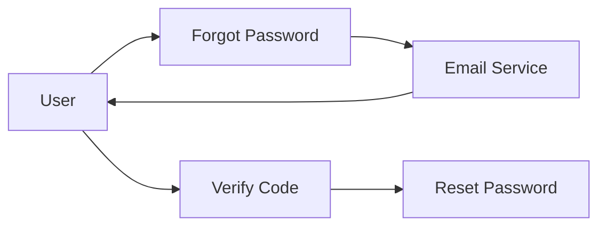

### Password Reset BPMN
```mermaid
flowchart LR
  start([Start])-->request[Submit Email]
  request-->send[Send Code]
  send-->wait{Cooldown}
  wait-->|Expires|send
  wait-->verify[Enter Code]
  verify-->reset[Set New Password]
  reset-->end([End])
```
