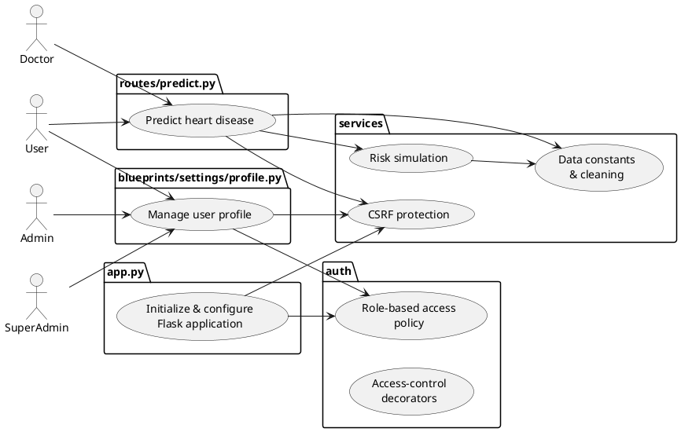

# Use Case Diagram & File Responsibilities

## Diagram

## File responsibilities and importance

- **app.py** – Builds the core Flask application, configures login management, branding, and themes, and registers helpers used across templates.  
  *Importance:* Central entry point that orchestrates all modules and ensures consistent configuration across the system.

- **auth/rbac.py** – Defines system roles and the policy mapping modules to permitted roles.  
  *Importance:* Source of truth for role-based access control; errors here could expose or block functionality.

- **auth/decorators.py** – Implements decorators such as `require_module_access` and `require_roles` to enforce RBAC policies on views.  
  *Importance:* Encapsulates access checks so routes remain concise and consistent.

- **routes/predict.py** – Handles the `/predict` endpoint, validating inputs against `services.data` constants and invoking risk projection via `services.simulation`.  
  *Importance:* Provides the primary user-facing prediction capability of the application.

- **services/data.py** – Contains dataset column definitions and type mappings that unify input handling across the application.  
  *Importance:* Ensures consistent data schema and validation for both training and inference.

- **services/simulation.py** – Simulates future risk by repeatedly calling the trained model with varying ages.  
  *Importance:* Enables longitudinal risk projections that underpin predictive features.

- **services/security.py** – Provides CSRF-protection decorators used by prediction and settings routes.  
  *Importance:* Guards against cross-site request forgery, maintaining trust and data integrity.

- **blueprints/settings/profile.py** – Manages user settings such as profile updates, password changes, and branding; each operation is protected by CSRF checks and RBAC rules.  
  *Importance:* Centralizes account management features for all roles.

- **tests/test_rbac.py** – Validates that each role only sees allowed pages; ensures navigation is hidden for unauthorised modules and API access returns 403.  
  *Importance:* Protects against privilege escalation by enforcing RBAC rules in both UI and API layers.

