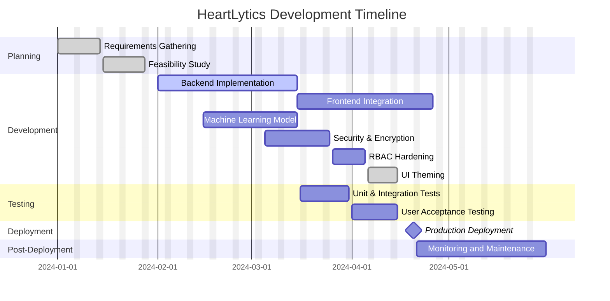

# Project Gantt Chart

The following Gantt chart outlines the major phases, tasks, and milestones for the HeartLytics web application. The chart renders in both GitHub and local Markdown preview.

## Summary
- **Planning** ensures clear requirements and feasibility.
- **Development** covers backend, frontend, model building, and UI theming (light/dark with transparent charts).
- **Testing** verifies functionality and user satisfaction.
- **Deployment** marks the production release.
- **Post-Deployment** includes monitoring and ongoing maintenance.
- Recent iteration adds cleaning-log normalization, a compact batch prediction notice, and a theme toggle on auth pages.

