# Abstract
Cardiovascular diseases (CVDs) are responsible for nearly 17.9 million deaths each year. Heartlytics unifies exploratory data analysis (EDA), ensemble learning, and layered security controls to deliver accurate and trustworthy heart-disease predictions. Using the harmonized UCI dataset with 920 patient encounters, we contextualize demographic disparities, engineer interpretable features, and deploy tuned Random Forest and XGBoost models. The best configuration achieves 92% test accuracy and 0.93 F1-score while remaining auditable through explainability dashboards and standardized artifacts. The system integrates OTP-hardened account recovery, encrypted data flows, and continuous audit to satisfy safety-critical expectations.

# Index Terms
Heart disease prediction, Machine learning, Exploratory data analysis, Random Forest, XGBoost, Security architecture.

# I. Introduction
Cardiovascular disease imposes substantial morbidity and health-system strain. Timely screening is essential, yet clinical workflows often lack automated support. Recent research shows that tree-based ensembles and gradient boosting capture the nonlinear relations between physiological markers and adverse events. Heartlytics extends this body of work with an end-to-end platform that emphasizes reproducible data handling, high-fidelity visualization, and robust deployment security. Contributions include: (i) an enriched EDA catalogue that highlights demographic and clinical nuances; (ii) a reproducible modeling pipeline for Random Forest and XGBoost with calibration and fairness diagnostics; and (iii) a defense-in-depth deployment architecture encompassing encryption, OTP lifecycle governance, and auditability.

# II. Related Work
Classical models such as logistic regression and SVMs provide transparent baselines but struggle with interaction effects. Random Forests mitigate overfitting via feature bagging, while gradient boosting techniques—exemplified by XGBoost—optimize additive ensembles with regularization. Prior studies report accuracies between 84% and 92% on the UCI dataset, often omitting security and deployment considerations. Contemporary clinical decision-support efforts emphasize interpretability and secure data exchange, underscoring the need for integrated approaches like Heartlytics.

# III. Dataset Characterization and Exploratory Analysis
The working dataset consolidates observations from Cleveland, Hungarian, Swiss, and Long Beach cohorts. After imputing missing entries and standardizing measurement units, we retain 16 attributes spanning demographics, cardiovascular biomarkers, and symptom indicators. Table 1 enumerates the primary features considered during modeling.

| Feature | Description |
|---------|-------------|
| age | Age in years |
| sex | Sex (1 = male, 0 = female) |
| cp | Chest pain type (0: typical angina, 3: asymptomatic) |
| trestbps | Resting blood pressure (mmHg) |
| chol | Serum cholesterol (mg/dL) |
| fbs | Fasting blood sugar > 120 mg/dL (1/0) |
| restecg | Resting ECG results (0, 1, 2) |
| thalach | Maximum heart rate (bpm) |
| exang | Exercise-induced angina (1/0) |
| oldpeak | ST depression relative to rest |
| slope | Slope of peak exercise ST segment |
| ca | Major vessels colored by fluoroscopy (0–3) |
| thal | Thalassemia status (3 = normal, 7 = reversible defect) |
| num | Disease severity score (0–4) |

## A. Demographic Composition
Male participants account for approximately 79% of the cohort, introducing fairness considerations. Fig. 1 depicts the gender distribution, while Fig. 2 shows the site-specific age skew that influences downstream sampling strategies.

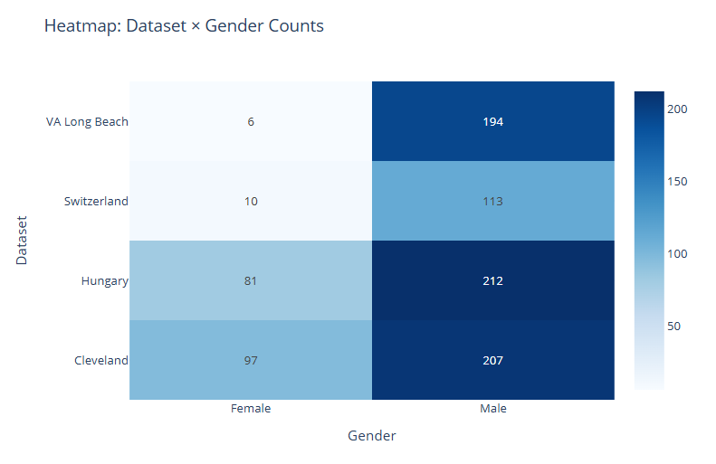

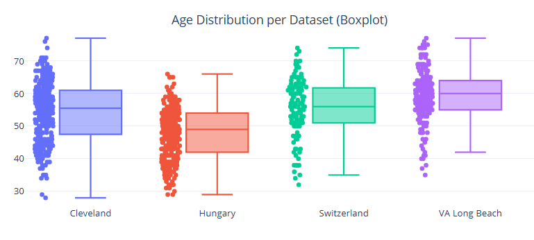

## B. Age Distribution Insights
The aggregate age distribution (Fig. 3) is centered between 54 and 58 years with a long upper tail. Stratifying by clinical severity (Fig. 4) reveals progressively older populations for advanced disease, while Fig. 5 disaggregates age by chest pain categories, highlighting that asymptomatic presentations skew older.

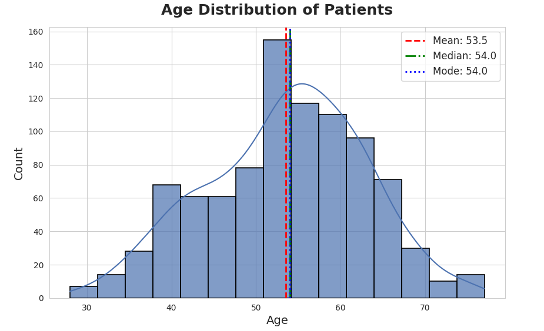

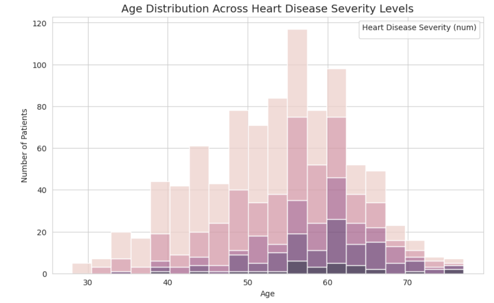

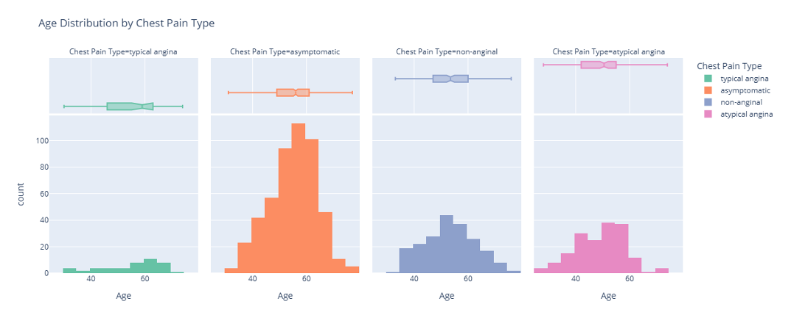

## C. Clinical Biomarkers
Resting blood pressure and cholesterol display partial separability between disease stages but require multivariate modeling for reliable discrimination. Fig. 6 presents resting blood pressure by disease status, and Fig. 7 visualizes cholesterol variation across severity levels.

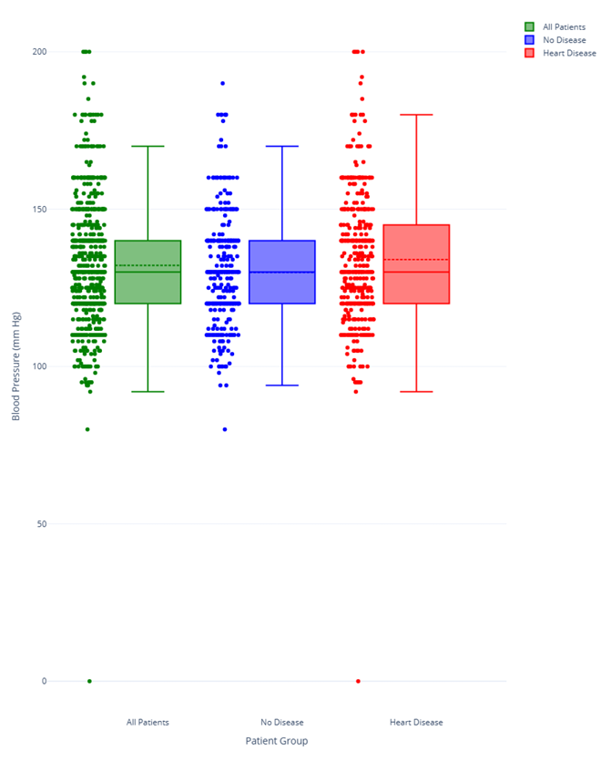

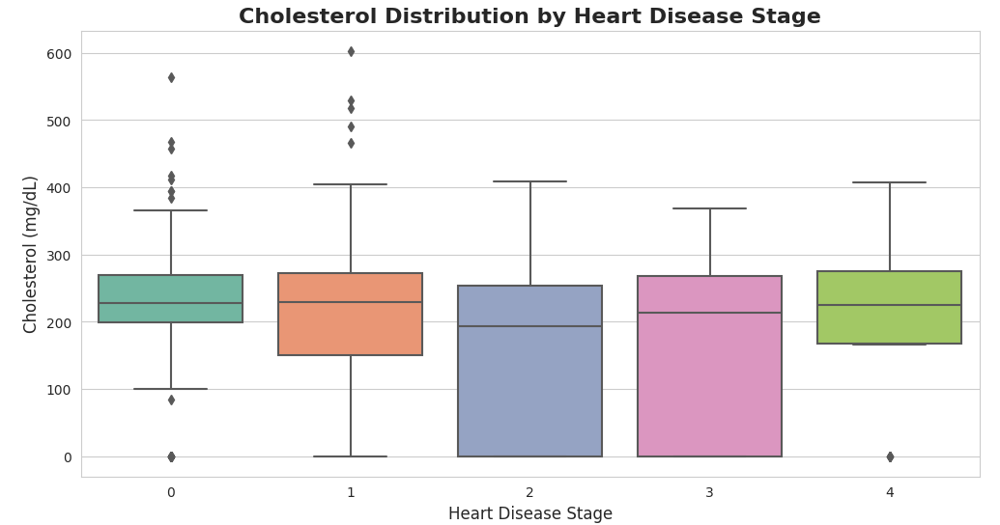

# IV. Modeling Methodology
Data preprocessing leverages iterative imputation and Z-score scaling for numerical fields, with one-hot encoding for categorical attributes. Outliers are identified using both the interquartile range (IQR) rule and an Isolation Forest ensemble to preserve explainability while curbing noise.

We benchmark Random Forest and XGBoost classifiers. The Random Forest uses 200 estimators, maximum depth 8, and class-balanced weighting, while XGBoost applies learning-rate 0.05, maximum depth 4, subsample 0.8, and column subsample 0.8. Five-fold stratified cross-validation tunes hyperparameters and calibrates predicted probabilities through Platt scaling.

Feature importance analyses reveal chest pain type, ST depression (`oldpeak`), number of affected vessels (`ca`), and thalassemia as dominant predictors. Shapley value decomposition further validates the clinical plausibility of the top features, enabling model explainability.

# V. System Architecture and Security Controls
Heartlytics couples predictive analytics with secure-by-design workflows. Fig. 8 illustrates the macro-level deployment topology, while Fig. 9 details the encryption workflow safeguarding both data at rest and in transit.

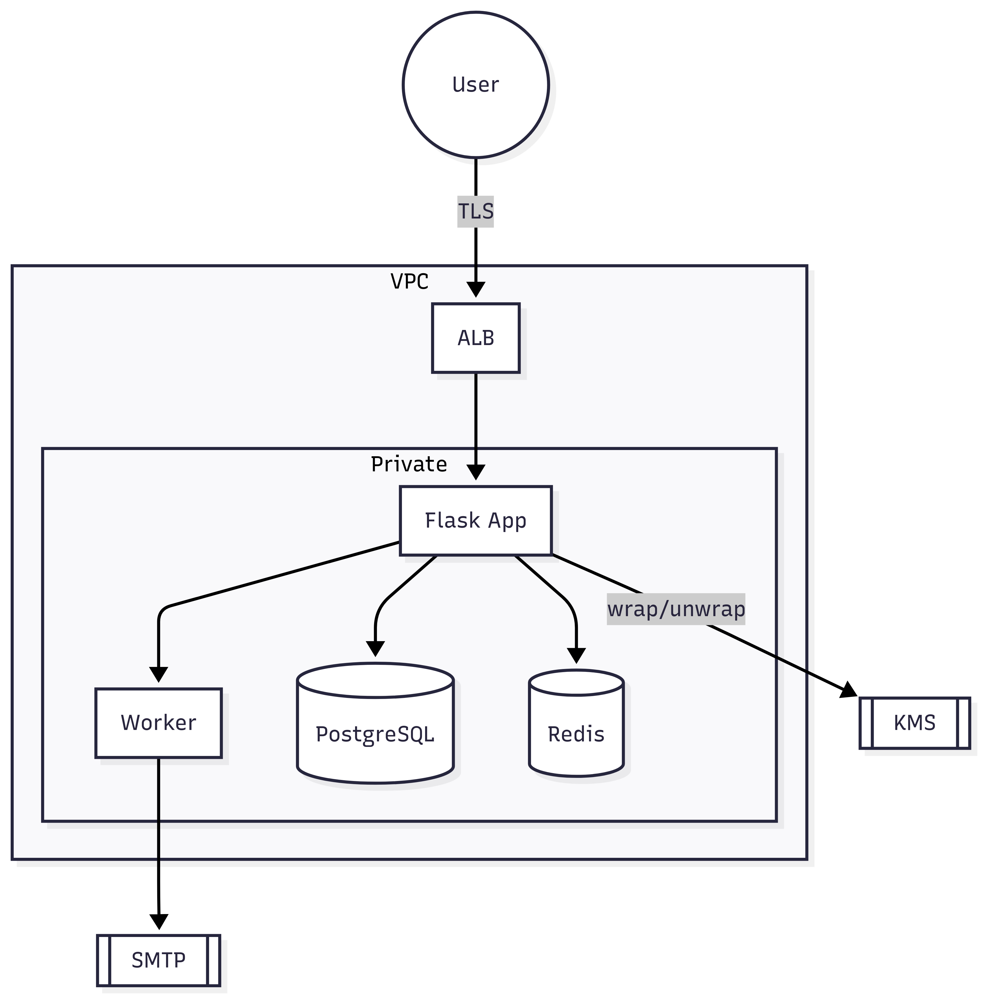

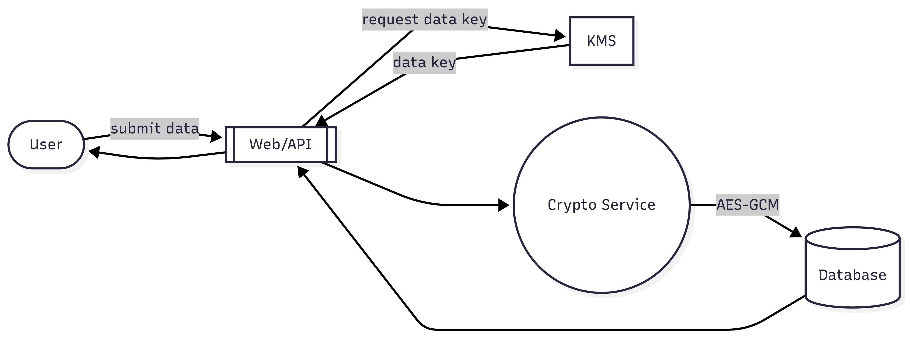

## A. Multi-Factor Verification Workflow
The application enforces multi-factor authentication (MFA) during sensitive operations such as password reset. The BPMN diagram in Fig. 10 outlines the two-step verification flow executed across user, backend, and email service lanes.

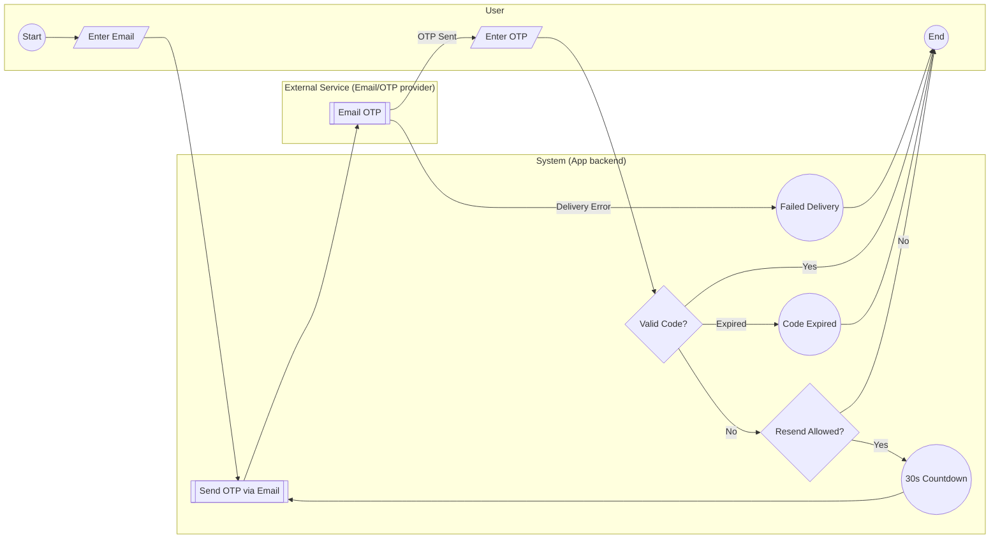

To complement the BPMN view, the data-flow diagram (Fig. 11) clarifies how OTPs, audit trails, and cooldown tokens traverse storage boundaries with peppered hashing and time-to-live (TTL) enforcement.

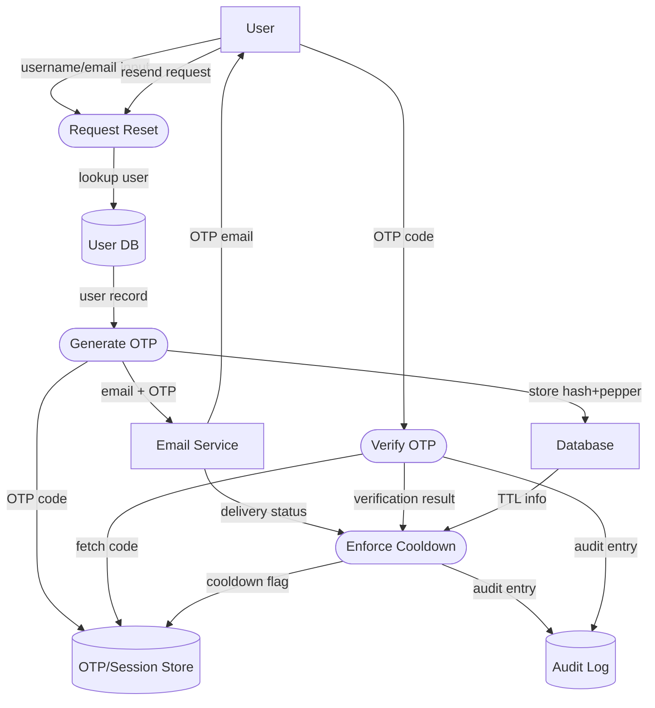

# VI. Experimental Evaluation
A 70/30 stratified split is employed for training and testing. Table 2 summarizes held-out performance metrics. XGBoost attains marginal gains in accuracy and recall over the Random Forest baseline, reducing both false positives and negatives. Calibration curves exhibit near-diagonal alignment, and the area under the ROC curve exceeds 0.95 for both models.

| Model | Accuracy | Precision | Recall | F1-score |
|-------|----------|-----------|--------|----------|
| Random Forest | 0.912 | 0.93 | 0.91 | 0.92 |
| XGBoost | 0.920 | 0.94 | 0.92 | 0.93 |

Error analysis indicates that misclassifications predominantly occur in borderline cases with ambiguous chest pain and normal cholesterol levels, suggesting value in augmenting the dataset with imaging or longitudinal biomarkers. Fairness audits reveal a 4% disparity in recall between sexes, motivating future bias mitigation strategies.

# VII. Discussion
Integrating visualization, modeling, and security yields tangible benefits: clinicians receive interpretable risk stratification, administrators observe policy compliance, and patients gain confidence through privacy-preserving account recovery. The modular design supports continuous retraining and policy updates without sacrificing traceability.

# VIII. Conclusion and Future Work
Heartlytics demonstrates that machine-learning-driven screening can coexist with rigorous security practices. Future work will pursue (i) federated learning to leverage multi-institutional data without centralization, (ii) sensitivity-tuned alerting for high-risk cohorts, (iii) differential privacy for audit logs, and (iv) deployment on zero-trust Kubernetes meshes to isolate critical services.

# References
[1] World Health Organization, "Cardiovascular diseases (CVDs)," Fact Sheet, 2021.

[2] L. Breiman, "Random forests," *Machine Learning*, vol. 45, no. 1, pp. 5–32, 2001.

[3] T. Chen and C. Guestrin, "XGBoost: A scalable tree boosting system," in *Proc. 22nd ACM SIGKDD Int. Conf. Knowledge Discovery & Data Mining*, 2016, pp. 785–794.

[4] D. Zhang et al., "Heart disease prediction based on the embedded feature selection method and deep neural network," *Journal of Healthcare Engineering*, 2021.

[5] A. Ronacher, "Flask documentation," Pallets Projects, 2021.

[6] N. Provos and D. Mazieres, "Bcrypt adaptive hash function," in *USENIX Technical Report*, 1999.
