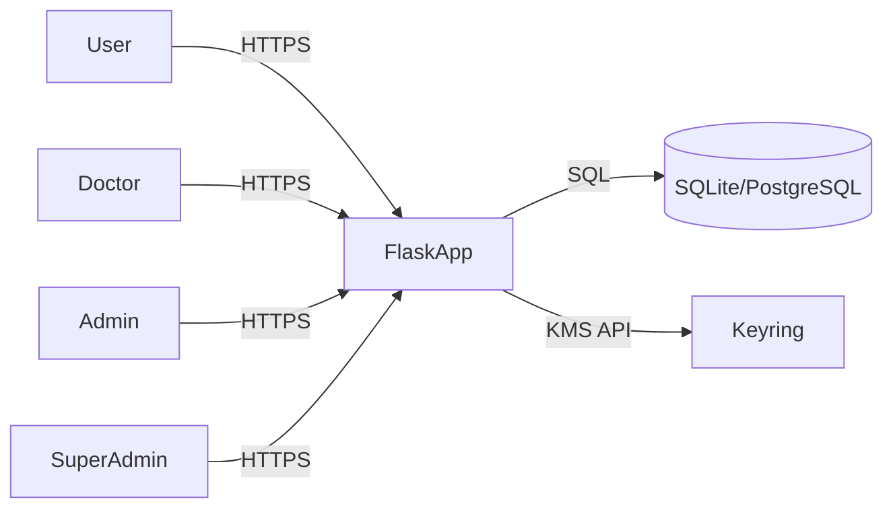
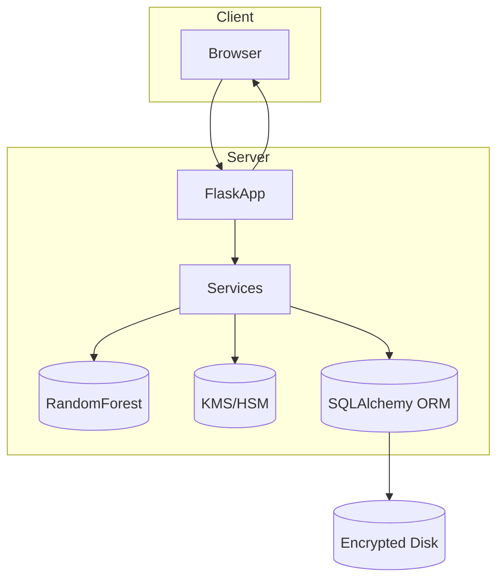
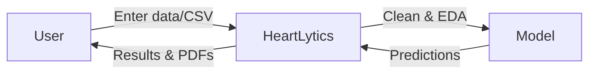
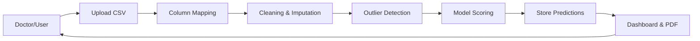
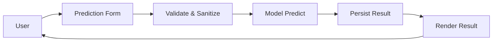
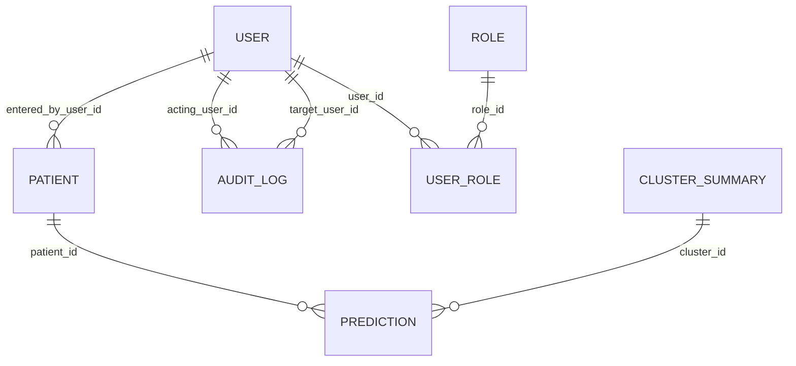
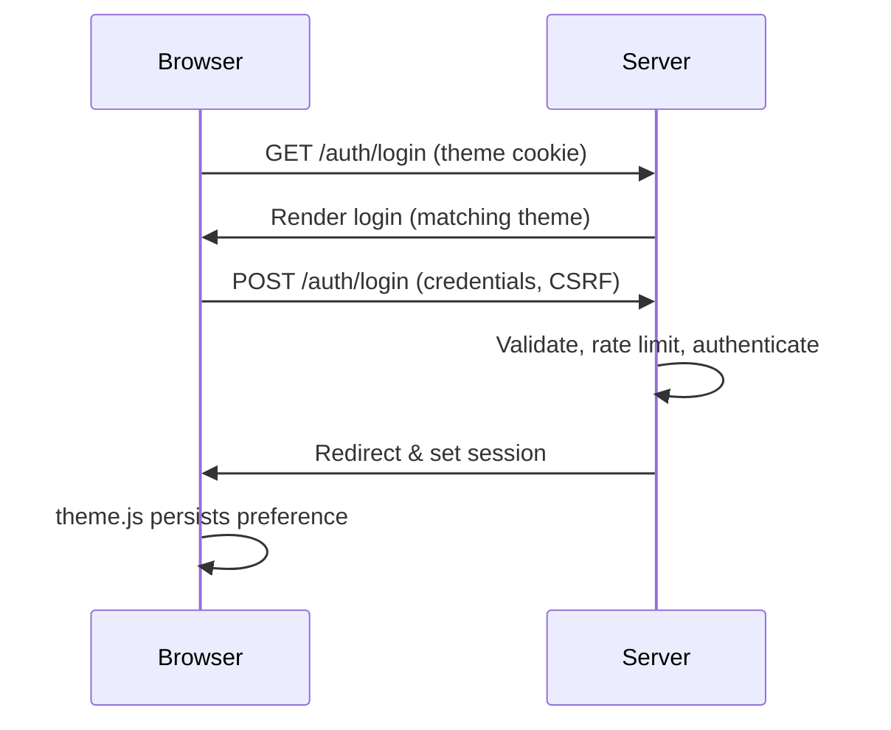
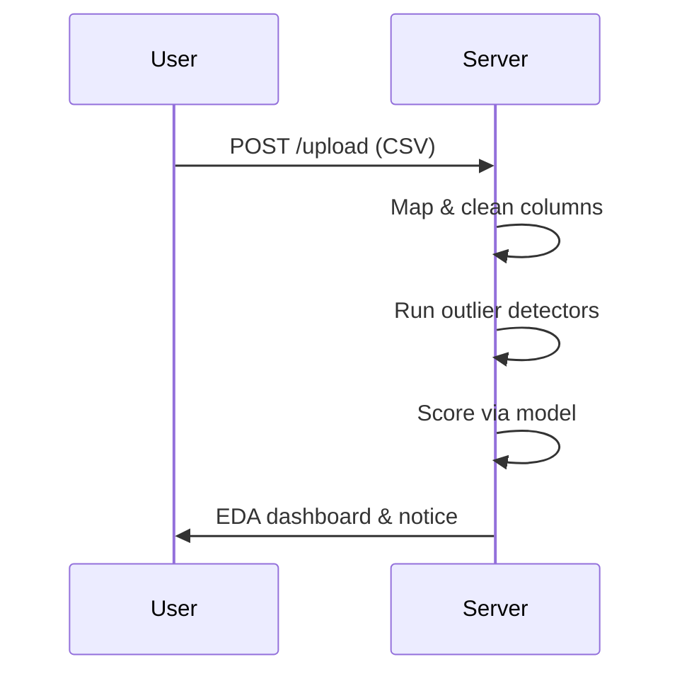
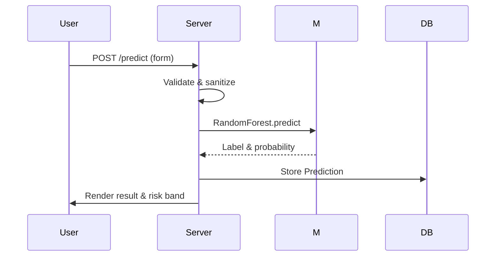

# HeartLytics: Secure Role‑Based Heart Disease Prediction Web Application

**Author:** HMRS Samaranayaka

**Affiliation:** NSBM Green University, Homagama, Sri Lanka

**Date:** 2025-08-01

## Abstract
HeartLytics is a full‑stack Python/Flask platform that predicts heart disease risk while enforcing strict security, encryption and user experience guarantees. The system ingests single records or CSV batches, cleans and analyzes data, executes a trained Random Forest model, and surfaces results through role‑aware dashboards and PDF reports. Application‑level envelope encryption protects patient identifiers, while Bootstrap 5 theming enables accessible light and dark modes. Extensive tests and a phased project plan demonstrate the feasibility of deploying HeartLytics as a secure clinical decision‑support prototype.

## Table of Contents
- [Working Topic](#working-topic)
- [Study Area and Study Objectives](#study-area-and-study-objectives)
- [Research Gap](#research-gap)
- [Research Problem / Questions](#research-problem--questions)
- [Research Strategy and Research Method](#research-strategy-and-research-method)
- [System Overview and Architecture](#system-overview-and-architecture)
  - [Context Diagram](#context-diagram)
  - [High-Level Architecture](#high-level-architecture)
- [Data Flow Diagrams](#data-flow-diagrams)
  - [Level-0 DFD](#level-0-dfd)
  - [Level-1 DFD – Batch Upload](#level-1-dfd--batch-upload)
  - [Level-1 DFD – Predict](#level-1-dfd--predict)
- [Data Model and Database Design](#data-model-and-database-design)
- [Security Architecture](#security-architecture)
- [UI/UX and Theming](#uiux-and-theming)
- [Key Execution Flows](#key-execution-flows)
  - [Login with Theme Persistence](#login-with-theme-persistence)
  - [Data Upload to EDA](#data-upload-to-eda)
  - [Prediction Inference](#prediction-inference)
- [Implementation Details and Configuration](#implementation-details-and-configuration)
- [Testing and Evaluation](#testing-and-evaluation)
- [Timeline and Project Management](#timeline-and-project-management)
- [Ethics, Privacy, and Compliance](#ethics-privacy-and-compliance)
- [Results, Discussion, and Conclusion](#results-discussion-and-conclusion)
- [References](#references)
- [Appendices](#appendices)
  - [RBAC Matrix](#rbac-matrix)
  - [API Endpoints](#api-endpoints)
  - [Extended Test Cases](#extended-test-cases)

## Working Topic
HeartLytics delivers clinician‑friendly heart disease risk prediction through a Flask web application backed by a scikit‑learn Random Forest model. It targets doctors, researchers and end‑users requiring an auditable, secure and themed interface for interactive or batch predictions.

## Study Area and Study Objectives
Cardiovascular diseases remain the leading global cause of death, accounting for approximately 17.9 million fatalities each year【f141cb†L222-L226】. Early detection enables timely intervention, yet traditional diagnostics like ECG and angiography can be invasive or resource intensive. Recent research applies supervised machine learning to improve risk stratification, with ensemble models such as Random Forest and XGBoost demonstrating strong predictive power【92cebb†L55-L57】【92cebb†L178-L187】.

HeartLytics situates itself in this landscape by providing:

* **Secure data entry and prediction** – single patients and CSV batches.
* **Exploratory Data Analysis (EDA)** – cleaning logs, summary statistics, correlation heatmaps and outlier detection using IQR, Isolation Forest, Z‑Score, LOF and DBSCAN algorithms【cdb8b2†L1-L76】.
* **Role‑aware dashboards** – Doctors review their own patients; SuperAdmins manage users and audit logs.
* **Envelope encryption** for patient data and names, storing ciphertext, nonce, tag and wrapped data keys with key identifiers【5337ea†L9-L21】.
* **Accessible theming** – default light mode, persistent theme cookie and chart patches for dark mode transparency【82b3da†L1-L13】【f25d16†L1-L64】.
* **PDF reporting** – per‑patient summaries via ReportLab【e82694†L1-L36】.

Functional objectives include accurate prediction, reliable batch processing, and intuitive dashboards. Non‑functional objectives target security (RBAC, CSRF, encryption), usability (theme persistence, responsive UI), and maintainability (tested services, modular blueprints).

## Research Gap
Existing ML pipelines often emphasize predictive accuracy but neglect operational concerns such as secure storage, role separation and accessible visualization. Prior work shows strong model performance【92cebb†L55-L57】, yet integration into a secure web platform with envelope encryption and comprehensive RBAC is less explored. HeartLytics addresses this gap by combining industry‑grade security controls【69cf44†L1-L32】 with robust data handling and theming, bridging machine learning outputs and clinical workflows.

## Research Problem / Questions
The central problem is how to deploy heart disease prediction in a manner that is secure, role‑aware and user friendly. Key research questions include:

1. How can application‑level envelope encryption protect patient identifiers without impeding usability?
2. What RBAC policies ensure clinicians access necessary modules while restricting administrative features?
3. How does persistent light/dark theming affect visualization clarity across modules?
4. Can batch EDA and outlier detection enhance clinician trust in model outputs?
5. How can the system be evaluated for security and functional correctness?

## Research Strategy and Research Method
The project follows Design Science Research Methodology (DSRM)【Peffers2007】. Artefacts include the Flask application, encryption utilities and theming modules. Iterative development cycles gathered requirements, implemented prototypes, and evaluated functionality through automated tests and user feedback. Data originates from the UCI Heart Disease repository【92cebb†L69-L71】; model analysis leverages Random Forest and XGBoost comparisons.【92cebb†L178-L187】 Logs and test outcomes form the basis of evaluation.

## System Overview and Architecture
HeartLytics uses a Python 3/Flask runtime with Jinja2 templates, SQLAlchemy ORM and a scikit‑learn Random Forest model (`ml/model.pkl`). SQLite is the default database, configurable via environment variables【ac6f4a†L15-L34】. Envelope encryption employs AES‑256‑GCM with per‑record data keys wrapped by a keyring service【5337ea†L3-L21】.

### Context Diagram

### High-Level Architecture

RBAC governs access: SuperAdmin has full rights, Admin lacks Predict/Batch/Dashboard/Research, Doctors see all modules, Users access Predict only【69cf44†L8-L20】.

## Data Flow Diagrams
### Level-0 DFD

### Level-1 DFD – Batch Upload

### Level-1 DFD – Predict

## Data Model and Database Design

Tables `patient` and `prediction` store encrypted fields (`*_ct`, `_nonce`, `_tag`, `_wrapped_dk`, `_kid`, `_kver`) alongside legacy plaintext columns while `READ_LEGACY_PLAINTEXT` remains true【aa345d†L19-L55】. Primary and foreign keys align with database.md relations.

## Security Architecture
Security controls include:

* **Authentication** – Flask‑Login sessions with rate limiting on login attempts【c1e841†L14-L44】.
* **Authorization** – Decorators enforce role and module access before route execution【afe6fc†L1-L46】.
* **Password Storage** – Argon2id hashing with transparent PBKDF2 upgrades【c1e841†L40-L56】【4088a1†L25-L48】.
* **CSRF Protection** – Form and API decorators verify tokens stored in session【2dc86b†L1-L27】.
* **Security Headers and Cookies** – Configured to limit sniffing, framing and track theme preference only【69cf44†L1-L32】.
* **Encryption** – Envelope scheme with AES‑256‑GCM; key rotation and cryptographic erasure follow docs/encryption.md guidelines【5337ea†L1-L33】.
* **Audit Logging** – Administrative actions recorded in `audit_log` with acting and target users【69cf44†L8-L20】【aa345d†L12-L18】.

## UI/UX and Theming
The default theme is light; a `theme` cookie and `localStorage` entry persist user preference. Server‑side hooks expose the theme before rendering to avoid flashes of incorrect color【5269c0†L1-L15】. Client scripts toggle modes and update the cookie, meta theme color and chart libraries; dark mode uses transparent chart backgrounds for seamless integration【10dec7†L1-L42】【f25d16†L1-L64】. A new evenly spaced navigation bar surfaces only permitted modules per role and shares motion tokens with buttons, dropdowns and tables, all honoring `prefers-reduced-motion`.

## Key Execution Flows
### Login with Theme Persistence

### Data Upload to EDA

### Prediction Inference

## Implementation Details and Configuration
Configuration resides in `config.py` with environment variables for database URI, model path, encryption flags, KMS provider and role strictness【ac6f4a†L15-L44】. Theme features read `SIMULATION_FEATURES` flags, while encryption toggles (`ENCRYPTION_ENABLED`, `READ_LEGACY_PLAINTEXT`) govern patient data handling. A CLI (`flask roles`) manages user roles and can be extended for key rotation (`manage_keys.py`).

## Testing and Evaluation
Automated tests cover authentication, RBAC, predictions, EDA payload, dashboard, encryption and theming (e.g., `tests/test_theme.py`) ensuring functional and security requirements. TEST_CASES.md enumerates manual and automated scenarios across modules, including CSRF, rate limiting, and theme persistence【02abce†L1-L126】. Running `pytest` executes unit and integration suites.

## Timeline and Project Management
The project followed a structured Gantt plan spanning planning, development, testing and deployment phases with milestones such as Security & Encryption, RBAC Hardening and UI Theming【dccd76†L5-L27】. Post‑deployment monitoring extends into maintenance.

## Ethics, Privacy, and Compliance
HeartLytics minimizes data retention and encrypts sensitive fields. Cookies store only non‑sensitive theme preferences; sessions timeout to reduce exposure. The system adheres to OWASP guidelines and enables cryptographic erasure via KMS key deletion【69cf44†L33-L48】【5337ea†L29-L33】. Deployments targeting EU residents must ensure GDPR compliance, user consent and breach notification procedures【69cf44†L33-L48】.

## Results, Discussion, and Conclusion
The implemented system validates the feasibility of delivering secure, role‑aware heart disease predictions through a themed web interface. Envelope encryption and RBAC address confidentiality and access control gaps identified in prior literature, while batch EDA and simulations foster transparency. Future work includes larger datasets, threshold tuning, fairness audits and integration with clinical information systems【76743a†L1-L7】.

## References
- Breiman, L. (2001). Random forests. *Machine Learning*, 45(1), 5–32.
- Chen, T., & Guestrin, C. (2016). XGBoost: A scalable tree boosting system. In *Proc. KDD'16* (pp. 785–794).
- Janosi, A., Steinbrunn, W., Pfisterer, M., & Detrano, R. (1988). Heart Disease Dataset. *UCI Machine Learning Repository*.
- Peffers, K., Tuunanen, T., Rothenberger, M. A., & Chatterjee, S. (2007). A design science research methodology for information systems research. *Journal of Management Information Systems*, 24(3), 45–77.
- Ronacher, A. (2021). Flask documentation. *Pallets Projects*.
- World Health Organization. (2021). Cardiovascular diseases (CVDs) [Fact sheet].
- Zhang, D., et al. (2021). Heart disease prediction based on the embedded feature selection method and deep neural network. *Journal of Healthcare Engineering*, Article ID 6260022.

## Appendices
### RBAC Matrix
| Role       | Predict | Batch | Dashboard | Research |
|------------|:------:|:-----:|:--------:|:--------:|
| SuperAdmin | ✔ | ✔ | ✔ | ✔ |
| Admin      | ✖ | ✖ | ✖ | ✖ |
| Doctor     | ✔ | ✔ | ✔ | ✔ |
| User       | ✔ | ✖ | ✖ | ✖ |

### API Endpoints
| Endpoint | Method | Description |
| --- | --- | --- |
| `/auth/login` | GET/POST | User authentication |
| `/auth/signup` | GET/POST | User registration |
| `/predict` | GET/POST | Single prediction form and result |
| `/upload` | GET/POST | Batch upload workflow |
| `/settings` | GET | User settings and activity |
| `/doctor/` | GET | Doctor dashboard |
| `/superadmin/` | GET | SuperAdmin dashboard |

### Extended Test Cases
See `TEST_CASES.md` for the full suite covering authentication, prediction, batch processing, encryption, RBAC, dashboards, settings, simulations, research viewer, security, regression, UI layout and theming scenarios【02abce†L1-L126】.
